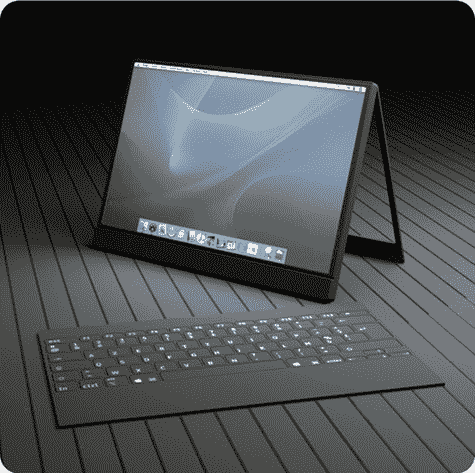
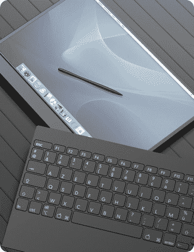

# 非官方的 MacTab:我们非常非常希望看到发布的 Mac 平板电脑

> 原文：<https://web.archive.org/web/http://techcrunch.com:80/2007/05/07/unofficial-mactab-the-mac-tablet-that-we-really-really-want-to-see-released/>

# 非官方的 MacTab:我们非常非常希望看到发布的 Mac 平板电脑

苹果的工业设计师刚刚被扬·勒·科洛勒展示出来。MacTab 将 [MacBook 的](https://web.archive.org/web/20230326065958/http://crunchgear.com/2006/11/08/macbooks-now-with-core-2-duo-at-apple/)外观与平板电脑的功能和便携性相结合。它由“磁铁”和“凹槽”固定在一起，背面的铰链让您可以在垂直位置使用它。另一个美丽的镜头…

所以，是的，忘了苹果的 iPhone 吧，让我们来看看一些令人兴奋的新电脑设计。

[Mactab](https://web.archive.org/web/20230326065958/http://www.yankodesign.com/product_info.php?products_id=2013)【Yanko 设计】