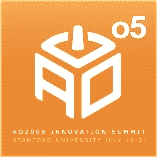

# 更新:永远在线(第三天)

> 原文：<https://web.archive.org/web/http://www.techcrunch.com:80/2005/07/23/update-always-on-day-three/>

***编者按:**随着《永远在线》活动接近尾声，我们想借此机会感谢托尼·帕金斯。托尼，你举办了一场精彩、有趣、有启发性的会议，我们非常自豪能成为其中的一员。非常感谢*

**事件:** [AlwaysOn](https://web.archive.org/web/20160226034750/http://www.alwayson-network.com/ao2005/)

**曾任职:**[2005 年 7 月 19 日](https://web.archive.org/web/20160226034750/http://www.techcrunch.com/?p=93)，[2005 年 7 月 20 日](https://web.archive.org/web/20160226034750/http://www.techcrunch.com/?p=94)，[2005 年 7 月 21 日](https://web.archive.org/web/20160226034750/http://www.techcrunch.com/?p=97)

发生了什么事？

对我们来说,“永远在线”的第三天是一个繁忙的混乱的走廊会议，快速(不那么快)前往沙丘路，在最后的面板上跳来跳去。

这里的日程链接是。

**链接到他人的想法:**

罗斯·梅菲尔德:“到了第三天，内容真正进入了状态。”

[丹·法伯](https://web.archive.org/web/20160226034750/http://blogs.zdnet.com/BTL/?p=1632&part=rss&tag=feed&subj=zdblog):比尔·乔伊对个人利用技术伤害我们的力量的恐惧*“无论是通过网络传播造成经济损失的病毒，还是有可能杀死数百万人的人造或工程生物制剂”，*乔治·吉尔德的反驳:*“当技术发展得更快时，自由社会更安全”*

丹·法伯在第二天也写了一篇关于 Skype 的优秀文章:“ [Skype:一个新的友好的通信垄断？](https://web.archive.org/web/20160226034750/http://blogs.zdnet.com/BTL/?p=1624&part=rss&tag=feed&subj=zdblog)

另见: [Infoworld](https://web.archive.org/web/20160226034750/http://weblog.infoworld.com/techwatch/archives/001706.html) 、 [Paul Kedrosky](https://web.archive.org/web/20160226034750/http://paul.kedrosky.com/archives/001569.html) 、 [Jeff Nolan](https://web.archive.org/web/20160226034750/http://sapventures.typepad.com/main/2005/07/picks_and_shove.html) 、 [Doc Searls](https://web.archive.org/web/20160226034750/http://doc.weblogs.com/2005/07/21#summitry) 、 [Ross Mayfield](https://web.archive.org/web/20160226034750/http://ross.typepad.com/blog/2005/07/is_the_whole_wo.html) 、[每日动态](https://web.archive.org/web/20160226034750/http://www.dailymotion.com/video/1374?from=rss)、 [IPCentral](https://web.archive.org/web/20160226034750/http://weblog.ipcentral.info/archives/2005/07/always_on.html) 、[社交客户](https://web.archive.org/web/20160226034750/http://www.socialcustomer.com/2005/07/the_fourth_wall.html)、[媒体游击队](https://web.archive.org/web/20160226034750/http://mmanuel.typepad.com/media_guerrilla/2005/07/ao_debuts_fresh.html)、 [Junto Boyz](https://web.archive.org/web/20160226034750/http://bernardmoon.blogspot.com/2005/07/ao-summit-review.html) 、[观点西方合伙人](https://web.archive.org/web/20160226034750/http://vpwpartners.blogs.com/viewpoint_west_partners/2005/07/alwayson_networ.html)、

**标签:** [alwayson](https://web.archive.org/web/20160226034750/http://www.technorati.com/tags/alwayson) ， [ao2005](https://web.archive.org/web/20160226034750/http://www.technorati.com/tags/ao2005) ， [ao100](https://web.archive.org/web/20160226034750/http://www.technorati.com/tags/ao100) ， [web2.0](https://web.archive.org/web/20160226034750/http://www.technorati.com/tags/web2.0) ， [techcrunch](https://web.archive.org/web/20160226034750/http://www.technorati.com/tags/techcrunch) ，[斯坦福](https://web.archive.org/web/20160226034750/http://www.technorati.com/tags/stanford)