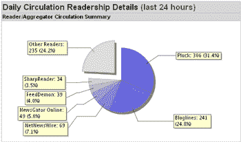

# 提要聚合器市场份额 

> 原文：<https://web.archive.org/web/http://www.techcrunch.com:80/2005/08/11/update-techcrunch-aggregator-share/>

# 饲料聚合市场份额

TechCrunch 今天已经成立两个月了。为了庆祝，我想我们应该公布一下 RSS 聚合器的市场份额。我们的数字与 [Pheedo](https://web.archive.org/web/20221129075203/http://www.pheedo.info/archives/000265.html) 和 [Feedburner](https://web.archive.org/web/20221129075203/http://www.feedburner.com/) 公布的数字相差甚远。主要的区别是勇气激增，遥遥领先——其他人也看到了这一趋势吗？

## FeedBurner 统计:

[FeedBurner 统计–前 5 名](https://web.archive.org/web/20221129075203/http://itmanagement.earthweb.com/columns/executive_tech/article.php/3517646)(2005 年 7 月)(删除 10 个最受欢迎的 feeds):

*   博客——19.49%
*   网络新闻专线——10.07%
*   iTunes——9.53%
*   火狐在线书签——7.25%
*   iPodder——7.17%

## Pheedo 统计:

 [Pheedo 统计–前 5 名](https://web.archive.org/web/20221129075203/http://www.pheedo.info/archives/000265.html):

> 与互联网上的其他 RSS 聚合器市场份额报告一致，Pheedo 在我们的 feed 阅读器统计中看到 Bloglines，其次是 Firefox，Thunderbird，NewsGator 和 Sharpreader。总的来说，这些阅读器被将近 70%订阅 Pheedo 管理的 RSS 内容的人所使用。

## TechCrunch 统计数据:

相比之下，TechCrunch 的读者人数(过去 24 小时内约有 1000 名订阅者):

TechCrunch 的前 6 名:

*   拔毛–31.4%
*   博客——24.8%
*   网络新闻专线——7.1%
*   在线新闻组——5.0%
*   饲料恶魔——4.0%
*   夏普读者——3.5%

Pluck 显然是 TechCrunch 读者的第一聚合器。其他博主是不是也看到了这种勇气的激增？