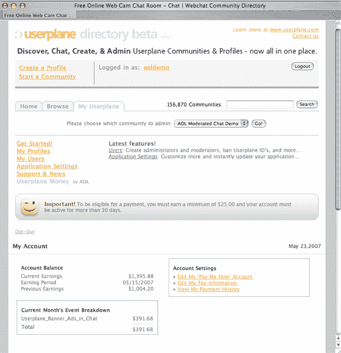

# 用户平面推出收入共享计划

> 原文：<https://web.archive.org/web/http://www.techcrunch.com:80/2007/05/29/userplane-launches-revenue-sharing-program/>

# 用户平面推出收入共享计划

网络信息服务公司 Userplane 推出了一项新的收入分享计划，将在线即时信息和网络聊天货币化

Userplane Money 在即时通讯、网络聊天和其他小工具中投放广告。据说这个新项目是社区平台中的第一个。

Userplane 首席执行官迈克·琼斯将他所谓的“平台网络”视为在线货币化的下一个领域。“Userplane Money 提供了丰富的应用程序体验，增加了客户网站的用户参与度，并为他们提供了新的收入渠道和更高的网站使用率”。

Userplane 于 2006 年 8 月被 AOL [收购](https://web.archive.org/web/20220818054952/http://www.beta.techcrunch.com/2006/08/14/userplane-purchased-by-aol/)，这个新项目与 AOL 更大的广告战略联系在一起。“AOL 为广告商提供了丰富的广告解决方案，包括 AOL 网络内的内部广告，通过 advertising 的第三方出版商关系，以及通过用户平面网络提供的长尾广告”Jones 说。“Userplane Money 扩大了 Userplane longtail 广告网络，并使广告商能够接触到他们以前在较小的、有针对性的利基网络社区中无法接触到的用户和库存”。

琼斯认为用户面的钱是一种回报用户的方式，并把这项服务定位为小型新兴网络社区的主要收入来源。

Userplane 的技术与收入共享计划的结合肯定会推动已经非常智能的产品的未来增长。

之前 TechCrunch 对用户面[的报道在这里](https://web.archive.org/web/20220818054952/http://www.beta.techcrunch.com/tag/userplane/)。

[http://www.google.com/notebook/static_files/blank.html](https://web.archive.org/web/20220818054952/http://www.google.com/notebook/static_files/blank.html)