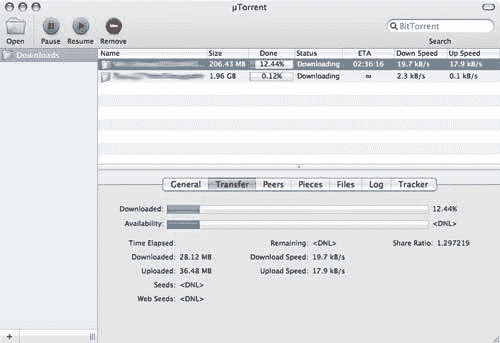

# uTorrent 进军 OS X | TechCrunch

> 原文：<https://web.archive.org/web/http://techcrunch.com:80/2007/06/27/utorrent-making-its-way-to-os-x/>

最受欢迎的 Windows BitTorrent 客户端之一 uTorrent 正在慢慢转向 Mac OS x。BitTorrent Inc .收购该公司后，它承诺 OS X 和 Linux 版本将很快推出。TorrentFreak 得到了 OS X 的拷贝，作为测试版，它看起来相当不错。

它拥有 Mac OS X 的易用性和外观，但却拥有 Azereus 和 uTorrent for Windows 的强大功能。与其他 OS X 客户端相比，uTorrent 拥有最快的下载速度。最受欢迎的特性之一肯定是一个健壮的 BT 客户端，它不像 Azereus 那样需要几个小时来加载。根据 TorrentFreak 的说法，该图标甚至不会在 dock 中弹出一个。它只是运行。我不知道你怎么想，但当它登陆 Mac OS X 时，我非常兴奋。点击链接了解全部内幕。

Mac 版的 uTorrent 即将推出:早期评论