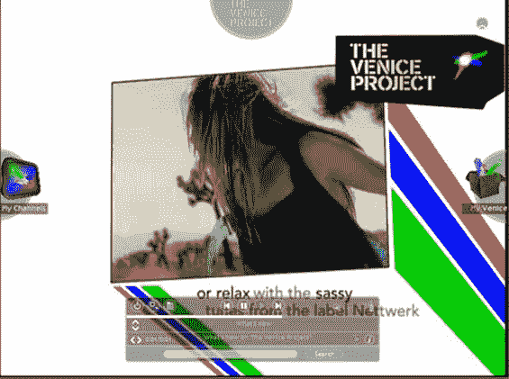
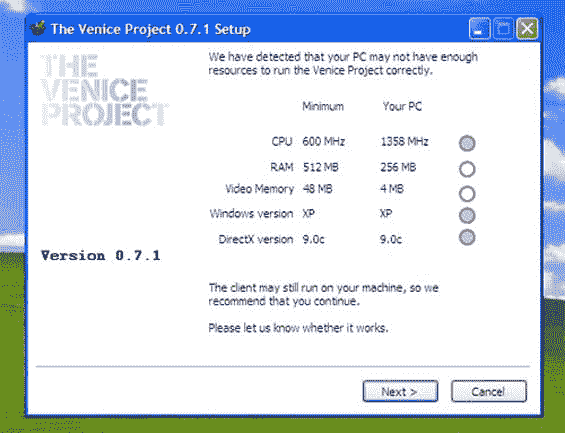
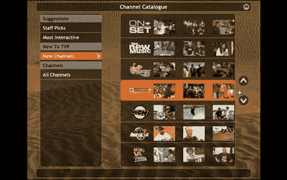

# 威尼斯项目详情和屏幕截图 

> 原文：<https://web.archive.org/web/http://www.techcrunch.com:80/2006/12/21/venice-project-details-and-screen-shots/>

# 威尼斯项目详情和屏幕截图

 来自 beta 测试者的[虚拟项目](https://web.archive.org/web/20221206060826/http://www.theveniceproject.com/)的更多信息开始出现。自从 10 月份[谣言浮出水面](https://web.archive.org/web/20221206060826/http://www.beta.techcrunch.com/2006/10/14/the-stars-align-for-the-venice-project/)以来，我们已经报道了新的网络电视(IPTV)项目的谣言。

上周，[center networks](https://web.archive.org/web/20221206060826/http://www.centernetworks.com/beta-tester-review-of-the-venice-project)(great up and coming blog)发布了一篇评论，但由于保密协议，没有包括截屏。尽管今天 [GigaOm](https://web.archive.org/web/20221206060826/http://gigaom.com/2006/12/21/first-look-venice-project/) 获得了[威尼斯项目](https://web.archive.org/web/20221206060826/http://www.beta.techcrunch.com/2006/12/12/the-venice-project-launches-in-private-beta/)[的测试账户](https://web.archive.org/web/20221206060826/http://www.theveniceproject.com/)并发布了截图——可能违反了 NDA。

围绕它的大部分炒作源于这样一个事实，即该公司是由 Kazaa 和 Skype 创始人尼可拉斯·曾斯特罗姆和贾纳斯·弗里斯创办的。否则，这可能会在我们几乎每天都看到的新 IPTV 创业公司的海洋中消失。但创始人如此高调的事实让威尼斯项目除了媒体炒作之外还有一个优势:这也可能让他们获得与电视网达成重要内容交易所需的地位。

然而，如果威尼斯项目有这些交易，内容还没有进入测试项目。GigaOm 报告称，网站上的内容非常少。

该软件似乎运行良好，但 Janus 和 Niklas 建立了一个桌面客户端，而不是浏览器软件。它只适用于 Windows 机器，最低要求是 600 MHz 的机器和 512 MB 的内存。这远远低于任何新的个人电脑的引擎盖下，但它仍然会阻止数百万用户与旧机器。当然还有 Mac 用户。

下面的屏幕截图。

