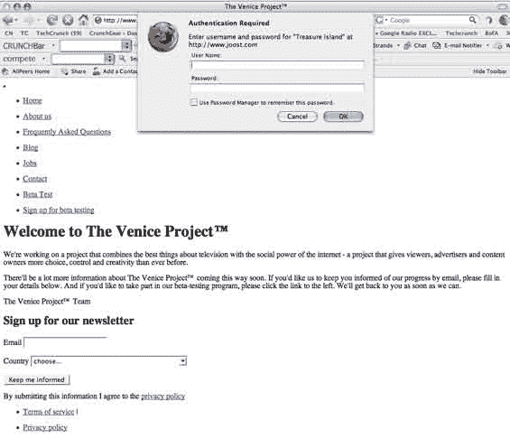
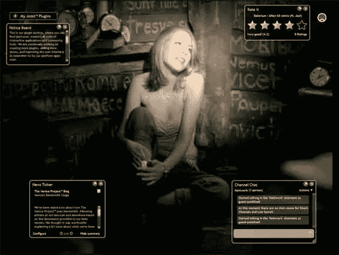

# 威尼斯项目启动名称:Joost TechCrunch

> 原文：<https://web.archive.org/web/http://www.techcrunch.com:80/2007/01/15/venice-project-launch-name-joost>

# 威尼斯项目启动名称:Joost

[威尼斯项目](https://web.archive.org/web/20220926095019/http://www.theveniceproject.com/)，由 Skype 创始人尼可拉斯·曾斯特罗姆和杰纳斯·弗里斯领导的新在线电视创业公司，一直是该公司的一个工作名称。直到今天，公司以外的人都不知道公司最终将推出的名字。

来自读者 Joost Schreve 的一个提示把我们带到了域名[Joost.com](https://web.archive.org/web/20220926095019/http://www.joost.com/):如果你多次点击“取消”按钮，一个无格式的网页就会弹出来，上面有关于威尼斯项目的信息。我们随后确认，这是该公司的实际启动名称。

Joost [最近](https://web.archive.org/web/20220926095019/http://www.beta.techcrunch.com/2006/12/12/the-venice-project-launches-in-private-beta/)进入了一个私人测试版，并且截图很快[发布到了网上](https://web.archive.org/web/20220926095019/http://www.beta.techcrunch.com/2006/12/21/venice-project-details-and-screen-shots/)。

此处[可访问的域名注册信息](https://web.archive.org/web/20220926095019/https://www.domaindiscover.com/domains/whois)显示，目前为一家名为 Oak Grove Corporation 的荷兰公司所有，邮寄地址在库拉索岛。

很少使用为预发布公司使用代码名称的策略。上一个引人注目的例子是马克·安德里森 2005 年的创业公司[宁](https://web.archive.org/web/20220926095019/http://www.ning.com/)，该公司在推出之前一直使用 [24 小时洗衣的工作名称。如果公司想在获得首选域名之前开始营销产品，这是有道理的，但这也稀释了品牌名称。](https://web.archive.org/web/20220926095019/http://www.beta.techcrunch.com/2005/10/04/ning-launches/)

 ***更新:**消息传出，所以公司现在正在发布更多信息。 [NewTeeVee](https://web.archive.org/web/20220926095019/http://newteevee.com/2007/01/15/new-venice-project-name-joost/#more-357) 刚刚发布了 Joost 的截图(这里对比旧截图[):](https://web.archive.org/web/20220926095019/http://www.beta.techcrunch.com/2006/12/21/venice-project-details-and-screen-shots/)*

