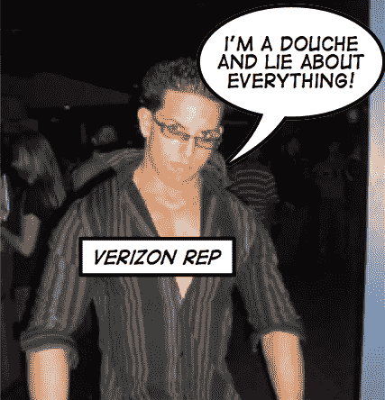

# 威瑞森先锋彩信上传…不！！！

> 原文：<https://web.archive.org/web/http://techcrunch.com:80/2007/07/24/verizon-pioneers-mms-uploadingnot/>

威瑞森或许可以称自己是该国最可靠的语音和数据网络，但他们肯定不是第一个允许用户通过彩信向 YouTube 上传视频的公司。事实上，他们发布新闻稿吹捧这样一个壮举是非常可笑和尴尬的。

威瑞森，仔细听我要说的话。一个多月前，Helio 是美国第一家允许用户通过彩信直接上传视频到 YouTube 的提供商。 [HelioUP](https://web.archive.org/web/20160526221707/http://crunchgear.com/2007/07/05/helio-and-youtube-get-official-plus-more/) 无疑是我在任何服务提供商身上看到的最酷的功能。你可以在几分钟内将图片上传到 Flickr，将视频上传到 YouTube。伸出你的头，威瑞森。在你信口开河之前，先把事实搞清楚。

[新闻稿](https://web.archive.org/web/20160526221707/http://news.vzw.com/news/2007/07/pr2007-07-24.html)