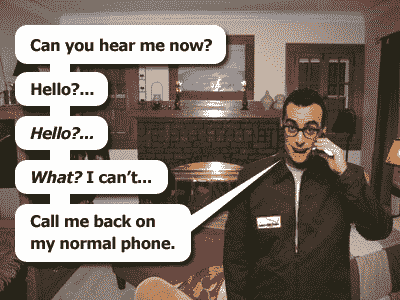

# 合同上的威瑞森销售代表菜肴| TechCrunch

> 原文：<https://web.archive.org/web/http://techcrunch.com:80/2007/03/06/verizon-sales-rep-dishes-on-contracts/>

 Consumerist 正在采访一位前威瑞森代表，他透露了该公司的客户维系政策，并在采访过程中迷惑了所有人。本质上，他描述了威瑞森用来奖励销售人员和惩罚愚蠢顾客的标准。他最好的建议？不要签两年的合同，如果你打得好，你得到的每部手机都可以是免费的，或者至少有 25%的折扣。

前威瑞森销售代表的 8 个自白