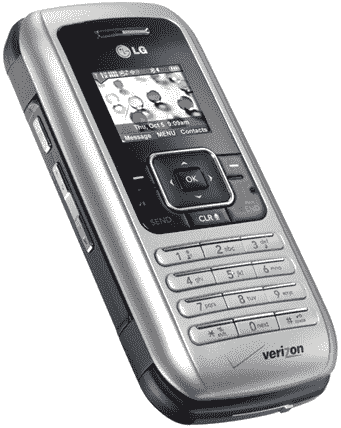
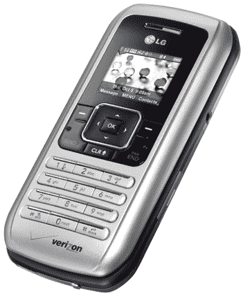
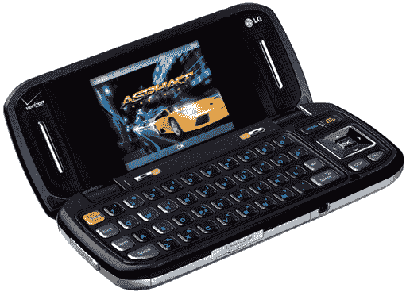

# 威瑞森 LG9900 官方营销照片——TechCrunch

> 原文：<https://web.archive.org/web/http://techcrunch.com/2006/10/17/verizons-lg9900-official-marketing-shots/>

# 威瑞森 LG9900 官方营销照

从这些产品照片来看，来自威瑞森的最新 LG communicator 9900 似乎即将推出。看起来比 9800 更性感，9900 有一个 200 万像素的摄像头(高于 FCC 文件中的 130 万像素)，microSD 插槽，QWERTY 键盘和内置扬声器。老款 communicator 的粉丝肯定会想升级，尽管外屏(依然)很小。

还没有发布日期或进一步的信息，但看看产品照片，当它像一个淘气的女孩一样为你打开时，你会流口水。

T3T5

[图片](https://web.archive.org/web/20210301020446/http://www.howardforums.com/showpost.php?p=8056131&postcount=1006)【霍华德论坛 via [Engadget](https://web.archive.org/web/20210301020446/http://www.engadget.com/2006/10/17/verizons-lg-vx9900-all-dressed-up-but-no-place-to-go/)