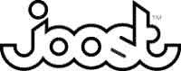

# 维亚康姆将与 Joost  签署协议

> 原文：<https://web.archive.org/web/http://www.techcrunch.com:80/2007/02/20/viacom-to-sign-deal-with-joost/>

# 维亚康姆将与 Joost 签署协议

 在[维亚康姆命令谷歌](https://web.archive.org/web/20230319223916/https://techcrunch.com/2007/02/02/gootube-slammed-by-viacom-takedown-demand/)从 YouTube 上撤下超过 10 万段据称拥有版权的视频后两周，媒体巨头即将与 [Joost](https://web.archive.org/web/20230319223916/http://joost.com/) 签署内容协议，华尔街日报今晚报道。Joost 是 Skype 创始人即将推出的 P2P 在线电视服务，据称其目标是挑战传统电视网络，而不是 YouTube。用户生成的内容不会出现在 Joost 上。该公司已经达成了一些规模较小的交易，包括与华纳的交易，但与维亚康姆的交易将是其迄今最大的交易。

尽管几乎一致的意见认为版权内容是 YouTube 成功的基础，但今天的竞争可能没有一些人想象的那么直接。原创和用户生成的内容现在在 YouTube 的发展中扮演着非常重要的角色。OK Go，Lonelygirl15 和无数其他 YouTube 上出生的明星已经有了自己的生活。

去年 12 月，维亚康姆退出了主要广播电台建立 YouTube 竞争对手的努力，实际上使这一努力陷入停顿。而回到更安全的领域在线(如果未推出的 Joost 可以被称为更安全)不可能是该公司的理想解决方案。维亚康姆首席执行官 Philippe Dauman 告诉《华尔街日报》,这种伙伴关系证明该公司非常愿意与保护其版权的在线分销商合作。

如果专业和用户创造的两个层次的创造力在不同的分销渠道中永远分裂，这将是世界的真正损失。YouTube 已经与音乐工作室和其他公司签署了许多分销协议，但自从被谷歌收购并未能向市场推出有效的版权保护技术以来，它作为版权内容分销渠道的可行性似乎已经下降。像 Joost 这样可行的在线替代品的出现可能会给我们很快就能在一个方便的地方观看 Beavis & Butthead 和 Chad Vader 的任何希望带来麻烦。