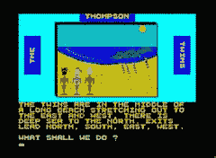

# 隐藏在唱片中的电子游戏

> 原文：<https://web.archive.org/web/http://techcrunch.com/2007/06/19/video-games-hidden-in-lp-records/>

# 隐藏在唱片中的电子游戏

我以前见过复活节彩蛋，其中小而有趣的游戏被嵌入到其他游戏或某种机器中，但这必须像隐藏的宝石一样将蛋糕带走。早在 20 世纪 80 年代，电脑程序员会将视频游戏代码嵌入唱片凹槽中。然后你可以播放这些隐藏的奇迹，方法是将唱片录制到磁带上，然后用磁带机运行程序。

最好的部分是汤普森双胞胎实际上在乙烯基上制作了一个视频游戏，你可以在一个基于文本的冒险游戏中控制双胞胎。根据 BoingBoing 的说法，这款游戏非常艰苦，需要玩家在一张纸上记录动词，以找出游戏中哪些命令有效。你知道，就像“去开门”和“开门”之类的。如果你对这些游戏的玩法感到好奇，有人好心地将汤普森双胞胎游戏移植到网络上。

[藏在唱片凹槽里的电子游戏](https://web.archive.org/web/20230327164421/http://www.boingboing.net/2007/06/19/video_games_hidden_i.html)

[汤普森双胞胎冒险游戏](https://web.archive.org/web/20230327164421/http://www.worldofspectrum.org/infoseekplay.cgi?title=Thompson+Twins+Adventure%2c+The&pub=C%26VG&year=1984&id=0007104&game=/games/t/ThompsonTwinsAdventureThe.tzx.zip&emu=3)【肯帕】