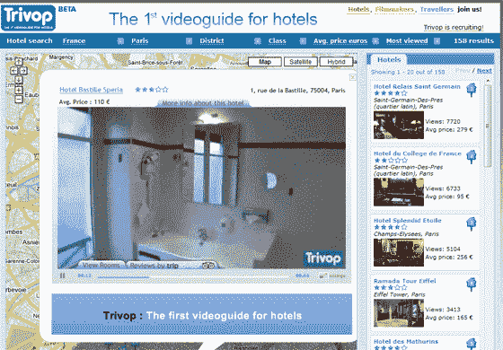

# 酒店视频指南:Trivop.com-

> 原文：<https://web.archive.org/web/http://www.techcrunch.com:80/2007/06/03/videoguide-for-hotels-trivopcom/>

# 酒店视频指南:Trivop.com

[【Trivop.com】](https://web.archive.org/web/20220812212914/http://www.trivop.com/)是一家在线酒店点评门户网站，号称是第一家酒店视频指南。

该网站来自法国巴黎的 VideoAgency，并在 5 月的欧洲 Startup 2.0 大会上进入了前五名。虽然它没有获胜，但我们已经有很多人联系 TechCrunch，告诉我们 Trivop 是一个值得深入研究的网站。

我们都知道网上订酒店是什么感觉。图像总是展示酒店最好的一面，但你经常会发现自己很失望，因为产品并不完全像预订点提供的描述或图片。

其核心是，Trivop.com 允许消费者通过观看酒店视频开始搜索酒店，为他们提供更丰富的数据，以便在决定入住酒店时做出明智的选择。

布局是纯粹的混搭。谷歌地图被用作添加酒店或用户提交视频的基础，酒店评论来自猫途鹰。用户可以探索酒店的周围环境、公共设施和所有卧室类别。

Trivop 已经开始覆盖巴黎，并计划在今年晚些时候将覆盖范围扩大到整个欧洲。

这是个聪明的主意。将视频与酒店评论数据和地图融合在一起，确实提供了一种有用的服务，有可能对旅行者产生广泛的吸引力。我以前在网上预订过酒店，但到达后才发现它们只比一个小屋好一点点，所以它自然也有个人吸引力。在未来的 12 个月里，当他们扩展到更多的城市时，绝对是一个值得关注的网站。有了这样一个简单而聪明的想法，Trivop.com 也一定会被复制。
