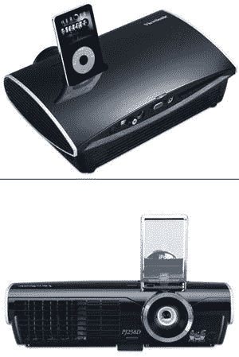

# 优派 PJ258D:首款配备 iPod Dock 的投影仪

> 原文：<https://web.archive.org/web/http://techcrunch.com/2007/03/12/viewsonic-pj258d-first-projector-to-feature-an-ipod-dock/>

优派 PJ258D 是第一款内置 iPod 基座的投影仪，将会让西装革履的男士和日常用户感到满意。笔记本电脑杂志刚刚给了它一个彻底的检查，只有几个问题。首先，虽然它很酷，而且它包括一个 iPod 基座来播放你的视频，但投影仪的菜单界面相当糟糕。由于 iPod 如此受欢迎的部分原因是它的设计美学(包括菜单)显示出大量的修饰，当使用投影仪时，整个体验受到打击。此外，投影仪上的许多按钮要么标签不好，要么很难够到。当然，这就是遥控器的作用，但如果优派想让我花 1000 美元买它的产品，它们就需要被发现。

总的来说，好处大于坏处。投影仪额定输出 2200 流明，但笔记本电脑发现它甚至可以做得更多一点。这幅画即使放大到 8 英尺的尺寸也能保持得很好。“开创性的”，优派 PJ258D 可能会受益于快速修订，但它仍然是一个很好的交易。在正式发布前的几个月，是时候转换所有的 Xvid，插入 iPod，观看 DVD 了。

[优派 PJ258D](https://web.archive.org/web/20140322060425/http://laptopmag.com/Review/ViewSonic-PJ258D.htm?Page=1) 【笔记本电脑杂志】