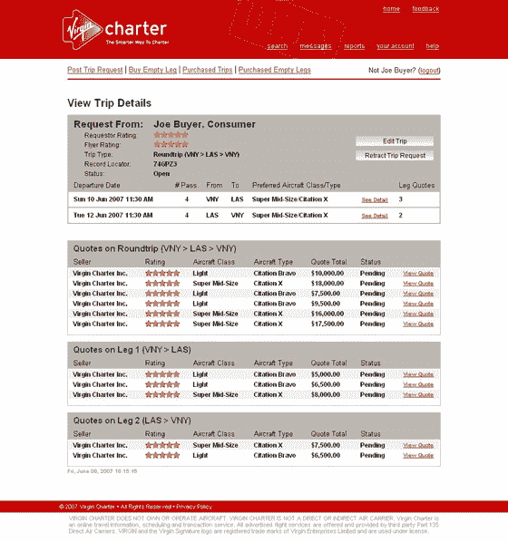

# 维珍包机发布:私人航空市场 

> 原文：<https://web.archive.org/web/http://www.techcrunch.com:80/2007/06/12/virgin-charter-launches-private-aviation-marketplace/>

  维珍最近的新业务，洛城基地[维珍包机](https://web.archive.org/web/20221209231436/http://www.virgincharter.com/)，今天晚上推出。该公司由首席执行官斯科特·达菲创建，希望实现包机预订系统的现代化。维珍的理查德·布兰森(Richard Branson)得到了这家初创公司的风声，给了该公司三倍于他们期望的资金，并获得了控股权。该公司更名为维珍特许公司。

如今，互联网在包租私人飞机方面没有发挥多大作用。好办客户让他们的组织联系一般控制 3-5 架飞机的小运营商。比较时间表并协商价格。整个过程平均需要五个小时。市场的低效率导致了非常高的价格——美国往返航班的平均价格为 18，000 美元，而跨洲的洛杉矶到纽约的航班通常为 35，000 美元到 65，000 美元。价格上涨很大程度上是由于“空航段”——航班必须提前返回，而不是等待客户，导致往返飞行需要四个航段。运营商列出他们的飞机的最著名的网站是 CharterX，但是它还有很多不足之处。

维珍包机公司旨在通过将包机的小运营商与潜在买家联系在一起，改变这一切。在一个很像在 expedia 上预订旅行的过程中，买家可以查看可用的飞机，查看公司和实际飞机的评级，并选择航班。卖家回复，航班预订。付款是通过网站使用信用卡、电汇或电子转账完成的，维珍公司收取一定比例的费用。飞行结束后，买卖双方都需要给对方留下反馈。维珍航空将努力填补这些空缺，这将大幅增加运营商的边际收入。

达菲说，美国是全球私人航空的最大市场，大约 75%的运营商位于美国。该公司目前只在美国起步。该公司已经进行了几个月的私人测试，到 9 月份有 60 家运营商(美国有 2500 家)，当他们上线时，他们计划拥有最大的 500 家运营商。

