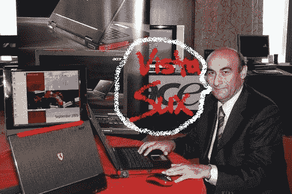

# Vista 让个人电脑行业失望，我 

> 原文：<https://web.archive.org/web/http://techcrunch.com:80/2007/07/24/vista-disappoints-pc-industry-me/>

# Vista 让个人电脑行业失望，我

 照片“增强”由彼得·哈提供。

宏碁 的掌门人蒋凡可·兰奇在被称为 Windows Vista 的房间里向大象致辞。对我来说，用“大事件”这个词没什么了不起的。

兰奇指出，系统不稳定，速度缓慢，以及许多人仍然要求在他们的机器上安装 XP 的事实是“整个行业都对 Windows Vista 感到失望”的主要原因

我最近购买了一台装有 Windows Vista Premium 的惠普 Pavilion s3120n，大约 15 分钟后，我也感到失望。这是最合适的词。我没有生气…只是失望。就像我父母在我玩迈克·朗普扎初中卖给我的打火机时不小心烧了我们的房子后的感受。

在人们最终开始闭嘴之前，Windows XP 有两个主要的服务包。希望随着 Vista 操作系统[的更新](https://web.archive.org/web/20201028061603/http://crunchgear.com/2007/07/19/vista-sp1-beta-is-not-coming/)，越来越多的这些问题会得到解决。

[Exklusiv 宏碁攻击微软](https://web.archive.org/web/20201028061603/http://ftd.de/technik/it_telekommunikation/:Acer%20Microsoft/229580.html)【via[PC World](https://web.archive.org/web/20201028061603/http://www.pcworld.com/article/id,134962-pg,1/article.html)