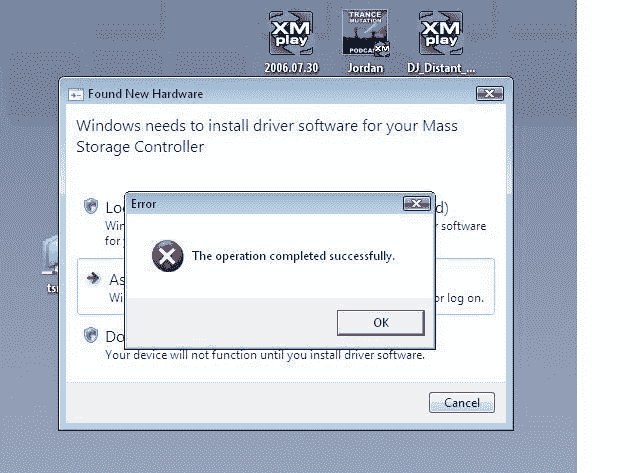

# Vista 错误报告:真正的测试版| TechCrunch

> 原文：<https://web.archive.org/web/http://techcrunch.com/2006/09/15/vista-error-reporting-really-beta/>

这是等待我们的吗？下一步是什么？"错误:你选择的音乐对 Zune 来说不够酷？""错误:插入软盘？"嘻嘻。

[有史以来最好的 Windows 错误](https://web.archive.org/web/20160325174028/http://dev.tufuncion.com/error_windows_vista)