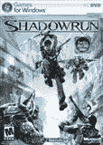

# 只有 Vista 的游戏获得 XP 化

> 原文：<https://web.archive.org/web/http://techcrunch.com/2007/06/27/vista-only-game-gets-xp-ified/>

# 只有 Vista 的游戏被 XP 化了

FASA Studio 的 *Shadowrun* 已经被黑客攻击，可以在 XP 上运行，尽管这是一个只有 Vista 才能运行的游戏。微软一直在推动其新的 DirectX 10 游戏架构，让人们升级到 Vista，以便玩最新的游戏。

问题是，大多数新游戏仍然运行在 DirectX 9 上——包括 *Shadowrun* 和 *Halo 2* 。微软将这些游戏归入了只支持 Vista 的类别，在仍在运行 XP 的游戏玩家中制造了一个书呆子愤怒的好例子。黑客组织 Razor 1911 发布了一个破解版的 *Shadowrun* ，将在 XP 上运行，这给微软带来了麻烦。下一个会是光环 2 吗？

[只能在 Vista 上运行的游戏在 XP 上被破解](https://web.archive.org/web/20130628125024/http://arstechnica.com/news.ars/post/20070626-vista-only-game-cracked-to-run-on-xp.html)