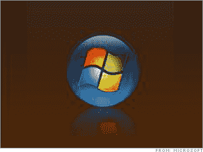

# Vista SP1 将于一周后推出

> 原文：<https://web.archive.org/web/http://techcrunch.com/2007/07/08/vista-sp1-coming-in-one-week/>

如果你因为期待 SP1 的发布而推迟了 Vista 的升级，那么你不用等太久了。据说 Vista SP1 的 Beta 1 将在 7 月 16 日那周的某个时间推出。如果这一切都是真的，那么我们可以预计 SP1 的最终版本将于 11 月发布，这将使它符合 Windows Server 2008 的 RTM，如果你感到幸运的话。

但不要指望 SP1 会增加任何新功能，相反，要指望它能解决或试图解决 Vista 用户自发布以来遇到的所有问题。下面是您可能会看到的修复列表:

> *性能调整减少了复制文件和关闭 Vista 机器的时间(是的，我知道微软说 Viista 关闭速度不是问题。毕竟，我想用户并没有那么疯狂。)
> *通过支持 SD 高级直接内存访问(DMA)提高了传输性能并降低了 CPU 占用率
> *支持 ExFat，用于闪存存储和其他消费设备的 Windows 文件格式
> *改进了 BitLocker 驱动器加密，不仅允许加密整个 Vista 卷，还允许加密本地创建的数据卷
> *能够在 x64 计算机上引导可扩展固件接口(EFI)
> *提高了防火墙会议空间和远程协助连接的成功率

[Vista SP1 beta 1 将于 7 月中旬推出](https://web.archive.org/web/20141221130454/http://blogs.zdnet.com/microsoft/?p=559)【ZD 网】