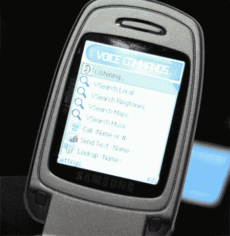

# 语音信号 VSearch:嵌入式语音搜索

> 原文：<https://web.archive.org/web/http://techcrunch.com/2007/03/27/voicesignal-vsearch-embedded-voice-search/>

VoiceSignal 使大多数语音识别系统出现在几乎每一款主流手机上。你说从未听说过他们？嗯，那是因为他们是如此的根深蒂固，以至于他们甚至很难在手机屏幕上看到他们的标志。然而，任何时候你发出语音命令，都有可能使用语音信号技术。

现在他们提供 VSearch，这是他们解决方案套件的一部分，它的工作方式就像过去的“呼叫简·史密斯”语音识别系统一样。这个新系统允许地图搜索、音乐搜索，甚至支持广告的本地搜索，所有这些都可以在手机上进行，只需最少的网络使用。

VoiceSignal 目前正在签署在线广告和其他商品的合作伙伴关系，他们正在从多个来源下载地图数据。在我看到的测试设备上，你甚至可以说“查找麦当娜”来获得麦当娜的铃声列表，甚至可以按名称和艺术家搜索个别歌曲。

根据即将到来的合作关系，在许多运营商的未来手机上寻找它。