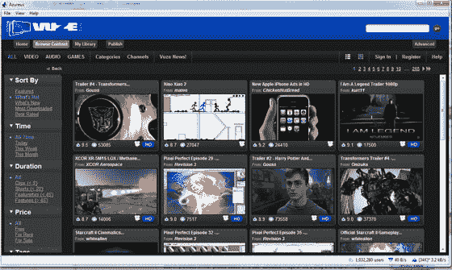

# Vuze:有着友好法律面孔的 BitTorrent——TechCrunch

> 原文：<https://web.archive.org/web/http://www.techcrunch.com:80/2007/06/21/vuze-bittorrent-with-a-friendly-legal-face/>

# Vuze:拥有友好法律面孔的 BitTorrent

 [Vuze](https://web.archive.org/web/20220516093501/http://www.vuze.com/) 是一个基于 BitTorrent 的内容分发平台，在不断增长的互联网电视市场上竞争。

Vuze 来自 BitTorrent 应用提供商 [Azureus](https://web.archive.org/web/20220516093501/http://www.beta.techcrunch.com/tag/azureus) ，构建于 Azureus 平台之上。我们之前在 06 年 12 月看了 Vuze，当时它还被称为 Zudeo [。在过去的六个月里，这个领域发生了很多事情，包括 Joost、Bablegum 和 Veoh 的发布。Vuze 也进化了。](https://web.archive.org/web/20220516093501/http://www.beta.techcrunch.com/2006/12/03/azureus-launches-zudeo/)

Vuze 的关键卖点是高清内容，该公司通过与 Starz、BBC、A&E 和 Showtime 等公司的各种内容合作伙伴关系提供高清内容。Vuze 非常重视社区；用户能够为内容创建频道、评级，并围绕内容进行对话。制片人可以上传他们的原创作品，甚至可以收取下载或租赁费。

很难将其与竞争产品进行比较，因为 Vuze 是一种截然不同的产品。Vuze 非常容易使用，鉴于它来自 Azureus，这本身就相当令人惊讶；Azureus BitTorrent 客户端因其相对复杂性而闻名。阵容是稳固的；是的，你可以从其他地方获得很多内容，但通常不是高清的。下载内容的需求可能被视为负面的，低分辨率预览可以按需提供，但对于全高清剪辑来说，这是一个等待的问题，取决于您的互联网连接，这可能需要很长时间的等待。然后是法律方面:这不是大多数人所知道的 BitTorrent，因为所有内容都是 100%合法的，在许多情况下是收费的，这就回避了一个问题:如果它不是按需交付的，你必须为其中的一些付费，难道一些用户不会免费下载非法版本吗？或许 iTunes 在这种模式下会有更好的对比。

总的来说，虽然 Vuze 是一个很好的包，也许没有 Joost 那么吸引人，但比 Bablegum 提供的更多。我还不能完全将其与 Veoh 进行比较，因为 Veoh 客户端已经在几个小时内崩溃了三次，但我可以肯定地说，Vuze 更稳定。
