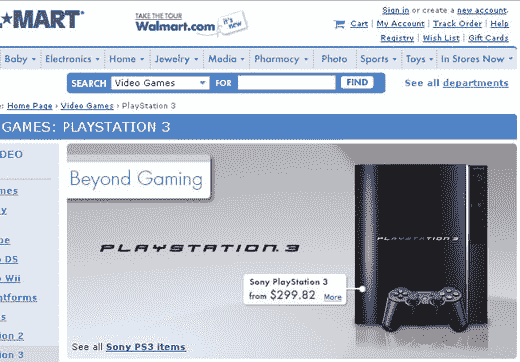

# 沃尔玛撤回 PlayStation 3 

> 原文：<https://web.archive.org/web/http://techcrunch.com:80/2006/10/25/wal-mart-rolls-back-playstation-3/>

# 沃尔玛回滚 PlayStation 3

我们最喜欢的美国零售商沃尔玛将 PlayStation 3 的价格下调至 299 美元，让所有游戏玩家都能体验 PlayStation 3 的“超越游戏”。

开个玩笑，但是，嘿，我们不能把这个不幸归咎于沃尔玛，一定有人看了 PS3 的价格标签后说，“这不可能！”并且改正了。不管是谁，谢谢你认为 600 美元买一台游戏机是荒谬的。太糟糕了，当它再次上涨时，它会提醒我们，如果我们购买主机，我们将有几个月吃不上饭。

[沃尔玛召回 PlayStation 3](https://web.archive.org/web/20130627213820/http://www.younewb.com/index.php/2006/10/24/wal-mart-selling-ps3s-for-300-thank-you-lord/) 【你这菜鸟】