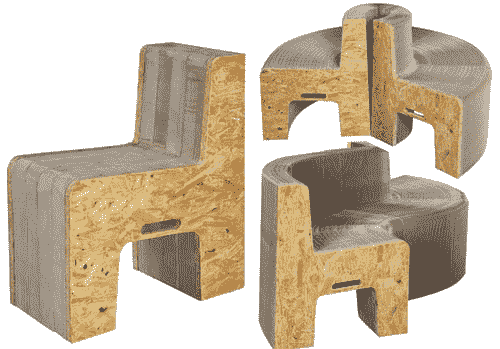

# 想买弹簧椅吗？

> 原文：<https://web.archive.org/web/http://techcrunch.com:80/2007/02/19/want-to-buy-the-slinky-chair/>

# 想买弹簧椅吗？

还记得[弹簧椅](https://web.archive.org/web/20210228011246/http://crunchgear.com/2007/02/05/slinky-chair-wows-crowd/)吗？它出现在《挖掘》2 月 8 日第八集中，凯文·罗斯和亚历克斯·阿尔布雷特在视频中多次提到这位火辣的日本女孩。实际上，女孩很可能是中国人，因为在剪辑中偶然听到普通话，但无论如何。我想我们对你来说都一样，凯文和亚历克斯。

原来这种椅子在网上售价 800 美元。根据[我的虚拟区域](https://web.archive.org/web/20210228011246/http://www.myvirtualzone.com/detail.aspx?ID=14163)的说法， [FlexibleLove 16 折叠椅](https://web.archive.org/web/20210228011246/http://www.myvirtualzone.com/detail.aspx?ID=14163)由“类似手风琴的蜂窝结构”制成，材料完全由再生纸和木制品制成。这把椅子最多能坐 16 个人，目前已经卖完了。

一把迷你版椅子也可供那些只想享受其设计而不想在客厅里找地方放它的人使用。

[FlexibleLove 16 折叠椅](https://web.archive.org/web/20210228011246/http://www.myvirtualzone.com/detail.aspx?ID=14163)【via[Digg](https://web.archive.org/web/20210228011246/http://digg.com/gadgets/Rockin_Folding_Couch_Buy_em_here)