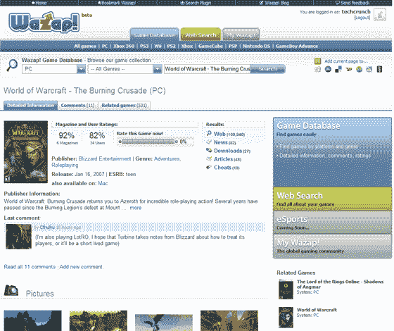

# Wazap 来到美国——TechCrunch

> 原文：<https://web.archive.org/web/http://www.techcrunch.com:80/2007/05/28/wazap-coming-to-america/>

 游戏搜索引擎 [Wazap](https://web.archive.org/web/20220517184229/http://www.wazap.com/) 即将登陆美洲。

这家德国公司不会在没有支持的情况下进入由新闻集团旗下的 IGN、雅虎和谷歌主导的市场。由 Wellington Partners 和 Partech International 牵头的 1190 万美元融资[让 Wazap 在征服美国市场的过程中获得了丰厚的回报。](https://web.archive.org/web/20220517184229/http://www.redherring.com/Article.aspx?a=20746&hed=Game+Search+Engine+Snags+%247.9M&sector=Industries&subsector=InternetAndServices)

Wazap 索引了 84，000 个不同的游戏信息来源。Wazap 根据质量、用户推荐和出版商提交的内容显示一小部分索引数据。

即使在测试期间没有大量说英语的用户群，游戏索引和评论也是广泛的。Wazap 确实与其他游戏评论网站有相似的功能。杂志评论有评分，截图和作弊器都有。决定性的特征在于交付。Wazap 不会通过一页又一页冗长的评论来掩盖用户生成的游戏评论和数据。Wazap 坚持其作为游戏搜索引擎的核心，以可访问的形式提供多种数据来源。用户通过页面下方的外部信息查看销售线索结果。

4 月份，Wazap 的独立用户流量为 1600 万，页面浏览量为 2.5 亿次。Wazap 的 Alexa 数据[显示该网站在全球排名 1435，Wazap 在日本最受欢迎网站中排名第 144，在德国排名第 612。](https://web.archive.org/web/20220517184229/http://www.alexa.com/data/details/traffic_details?url=wazap.com)

这些都是令人瞩目的数字，表明作为一个游戏目的地，Wazap 可能会在最大的游戏市场美国取得成功。

Wazap 的英文版将于 6 月推出。

 