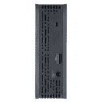

# WD My Library 视频版 DVR 存储扩展器 

> 原文：<https://web.archive.org/web/http://techcrunch.com/2007/07/03/wd-my-library-video-edition-dvr-storage-expander/>

# WD My Library 视频版 DVR 存储扩展器

如果你有一台有线电视公司的科学 Atlanta 8300 系列数字录像机，也许你会注意到它有一个 eSATA 端口。嗯，西部数据公司上周宣布了一个你会想插入它的东西:我的图书馆视频版 DVR 扩展器。这款售价 199 美元的 500GB 外置硬盘可以让你在有线电视盒中添加长达 60 小时的高清或长达 300 小时的标清数字电视存储。

  只需通过背面的 eSata 端口连接硬盘，即可开始录音。就像该公司的 MyBook 系列外置硬盘一样，它内置于一个基本上是散热器的东西中，允许它在不需要风扇的情况下几乎安静地运行。它还具有低强度 LED 活动和容量表，因此您可以知道何时录制以及驱动器上有多少可用空间。

目前，Scientific Atlanta 8300 机顶盒(包括 8300 HD、8300 MR 和 8300 HD-MR)是唯一受支持的型号，但随着其他有线和卫星 DVR 制造商在其当前的 DVR 上启用 eSATA 端口，Western Digital 打算使 My Library 兼容。

[西数我的图书馆视频版](https://web.archive.org/web/20221029115258/http://www.wdc.com/en/products/Products.asp?DriveID=334)