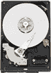

# WD 的 GreenPower 硬盘每年可为您节省 10 万美元

> 原文：<https://web.archive.org/web/http://techcrunch.com/2007/07/23/wds-greenpower-hard-drives-can-save-you-100000-annually/>

# WD 的 GreenPower 硬盘每年可为您节省 10 万美元

当然，前提是您拥有并运营一个拥有 10，000 个驱动器的数据中心。但是，即使你不这样做，GreenPower 系列驱动器也能显著降低所需电量。根据 Western Digital 的数据，一个典型的 1TB 硬盘使用 13.5 瓦，而 GP 硬盘减少了 5 瓦以上，因此几乎减少了一半的功率。

本月，你将可以在 WD 的 My Book 外部存储设备中购买 WD Caviar GP 1TB 硬盘(这是一个节省电力的好地方，因为你通常会一直开着这些设备)。更多桌面、娱乐和网络应用的版本将在 8 月份推出。那些寻找低功耗笔记本电脑驱动器的人，该公司的 Scorpio 驱动器已经上市。[阅读更多关于绿色能源驱动](https://web.archive.org/web/20130628170948/http://www.wdc.com/en/company/greenpower.asp)的信息。