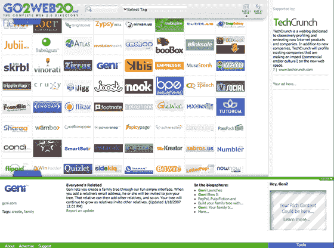

# Web 2.0 目录 Go2Web20 升级

> 原文：<https://web.archive.org/web/http://www.techcrunch.com:80/2007/02/05/web-20-directory-go2web20-upgraded/>

# Web 2.0 目录 Go2Web20 已升级

  [当我们第一次写](https://web.archive.org/web/20230222044549/https://techcrunch.com/2006/09/15/every-web-20-company-on-one-page/)关于 [Go2Web20](https://web.archive.org/web/20230222044549/http://www.go2web20.net/) 在 2006 年 9 月发布的时候，它是以色列创始人[奥利·雅库勒](https://web.archive.org/web/20230222044549/http://go2web2.blogspot.com/)和[埃亚尔·沙哈尔](https://web.archive.org/web/20230222044549/http://www.mantis.co.il/)的一个副业项目。他们认为这是一个很好的方式来展示他们对 Flash 的热情，并保持一个新的网站启动标志和基本信息的目录。

该网站被证明是如此受欢迎，以至于两人一直在继续工作，增加新的公司和产品(现在有近 800 个)。他们还从根本上改变了用户界面，并在网站中添加了 Ajax 组件。如果有什么不同的话，这是一个有趣的网站，只需点击一下，阅读一下创业公司的信息。

徽标可以按添加日期或字母顺序排序。点击一个标志会在页面底部显示基本信息，公司也可以添加他们自己的代码(一个视频，RSS 源，小工具等等。).

该网站也是第一次接受广告客户(我们在网站上做广告来支持这个项目)。广告信息在这里是。

