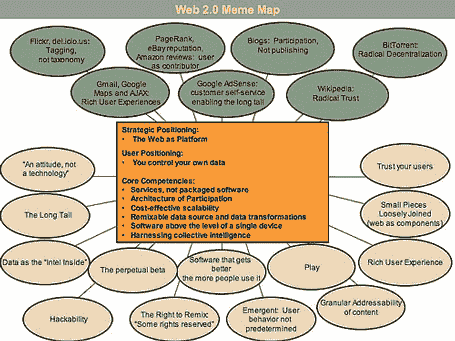

# Web 2.0 本周(9 月 18 日至 24 日)

> 原文：<https://web.archive.org/web/http://www.techcrunch.com:80/2005/09/26/web-20-this-week-september-18-24/>

**Web 2.0 This Week** **September 18-24**

周四，我们的 TechCrunch Meetup 参加人数非常多，我们期待着定期举办未来的活动(至少每月一次)。有这么多聪明、执着的人在一个晚上呆在一所房子里是很棒的——演示绝对精彩，整个晚上都有很多异花授粉。

再次感谢[参加](https://web.archive.org/web/20220811104729/http://wiki.beta.techcrunch.com/second_meetup_bbq#attendees)并上传[图片](https://web.archive.org/web/20220811104729/http://wiki.beta.techcrunch.com/second_meetup_bbq#pictures)的所有人。

太多了，不适合本周的总结。差点进去的东西:

上周发布了一款新的谷歌产品，当然，这是一周[的第一款](https://web.archive.org/web/20220811104729/http://www.beta.techcrunch.com/2005/09/14/google-blog-search-first-impressions/)。

## 1.最近的 TechCrunch 简介

[FilmLoop](https://web.archive.org/web/20220811104729/http://www.beta.techcrunch.com/2005/09/19/filmloop/) ， [Mefeedia](https://web.archive.org/web/20220811104729/http://www.beta.techcrunch.com/2005/09/19/mefeedia-named-best-of-the-web/) ， [Placeopedia](https://web.archive.org/web/20220811104729/http://www.beta.techcrunch.com/2005/09/19/mash-up-placeopedia/) ， [ObjectGraph](https://web.archive.org/web/20220811104729/http://www.beta.techcrunch.com/2005/09/19/ajax-dictionary-objectgraph/) ， [Google Wifi](https://web.archive.org/web/20220811104729/http://www.beta.techcrunch.com/2005/09/20/google-wifi-to-launch/) ， [Feedburner](https://web.archive.org/web/20220811104729/http://www.beta.techcrunch.com/2005/09/21/feedburner-releases-important-stats/) (统计) [Truveo](https://web.archive.org/web/20220811104729/http://www.beta.techcrunch.com/2005/09/21/truveo-video-search/) ， [TailRank](https://web.archive.org/web/20220811104729/http://www.beta.techcrunch.com/2005/09/21/tailrank-a-tool-for-the-long-tail/) ， [Searchfox](https://web.archive.org/web/20220811104729/http://www.beta.techcrunch.com/2005/09/21/searchfox-more-beta-invitations-available/) (更新) [VideoEgg](https://web.archive.org/web/20220811104729/http://www.beta.techcrunch.com/2005/09/21/videoegg-launches/) ，[远程控制邮件](https://web.archive.org/web/20220811104729/http://www.beta.techcrunch.com/2005/09/24/remot-control-mail-is-a-great-idea/)，[SLA](https://web.archive.org/web/20220811104729/http://www.beta.techcrunch.com/2005/09/25/send-voice-messages-with-slawesome/)

## 2.FeedBurner 统计反映了一般博客的增长

FeedBurner [于 9 月 20 日在其博客上发布了新的运营统计数据](https://web.archive.org/web/20220811104729/http://www.burningdoor.com/feedburner/archives/001422.html),[lots](https://web.archive.org/web/20220811104729/http://sapventures.typepad.com/main/2005/09/feedburner_aggr.html)[人](https://web.archive.org/web/20220811104729/http://blogs.msdn.com/alexbarn/archive/2005/09/21/472365.aspx) [注意到](https://web.archive.org/web/20220811104729/http://www.technoogle.com/?p=251)[指数增长](https://web.archive.org/web/20220811104729/http://www.feld.com/blog/archives/2005/09/upward_sloping.html)。他们现在管理着 100，000 个订阅源，超过 400 万人订阅了这些订阅源。

我们的[评论在这里](https://web.archive.org/web/20220811104729/http://www.beta.techcrunch.com/2005/09/21/feedburner-releases-important-stats/)。我们祝贺 Feedburner 的增长，并注意到这一趋势可能反映了 RSS 在网络上的类似指数增长。所以，祝贺我们所有人！

## 3.Web 2.0 迷因地图

蒂姆·奥莱利在 Flickr 上发布了他的 Web 2.0 迷因图。

> “什么是 Web 2.0？”2005 年富营集思会。模因图改编自 Beam Inc .开发的商业模型图。

当我们都在努力定义 Web 2.0 时，视觉提示总是有帮助的。不过，我不像其他人那样对此感到兴奋。简单更好。我们还不简单。

在迷因图上可以看到[理查德·麦克马努斯](https://web.archive.org/web/20220811104729/http://www.readwriteweb.com/archives/002834.php)、[丹·格罗斯曼](https://web.archive.org/web/20220811104729/http://www.aventureforth.com/2005/09/22/tim-oreillys-web-20-map/)和其他人。

## 4.Ajax 不完美？

风险投资家丹·格罗斯曼(Dan Grossman)的年轻博客现在在我的必读名单上，[写了一篇全面易懂的文章](https://web.archive.org/web/20220811104729/http://www.aventureforth.com/2005/09/21/whats-wrong-with-ajax/)，详细描述了 Ajax 的一些缺点。

## 5.微软重组

微软上周二宣布了一项大规模重组。参见我们详细的[分析，这里](https://web.archive.org/web/20220811104729/http://www.archimedesventures.com/?p=13)讨论为什么这对 Web 2.0 很重要(由 TechCrunch 编辑 Keith Teare 撰写)。

## 6.Qumana 博客调查

[Qumana](https://web.archive.org/web/20220811104729/http://www.qumana.com/) 完成了对博客作者的调查，并将结果分两部分发布:

*   第 1 部分-http://blog . qumana . com/blog/_ archives/2005/9/22/1250138 . html
*   第 2 部分-http://blog . qumana . com/blog/_ archives/2005/9/24/1255292 . html

一些数据令人惊讶——34%的受访者阅读 30 条或更少的信息，平均每周写博客的时间徘徊在 3-5 小时左右。这两个数据都远低于我的预期。有很多额外的东西值得注意。

## 7.我们必须想办法把它放进去

[是的，这是 Web 2.0，我不想和你争论这个问题](https://web.archive.org/web/20220811104729/http://www.savemyass.com/home)。:-)这个网站挽救的关系可能比所有在线约会网站加起来还多。