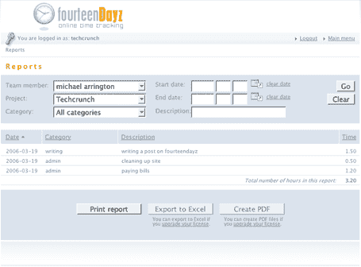

# Web 2.0 时间追踪器:14Dayz | TechCrunch

> 原文：<https://web.archive.org/web/http://www.techcrunch.com/2006/03/18/web-20-time-tracker-14dayz/>

  [14Dayz](https://web.archive.org/web/20160305042914/http://www.14dayz.com/) 是一家总部位于荷兰的公司，虽然我有机会测试它，但它仍处于私人测试阶段。它只做一件事，而且做得很好:时间追踪。它允许多个项目，类别和子类别，以及多个用户。报告可以在浏览器中查看，或者以 excel 或 pdf 格式导出。

定价并不便宜。有一个免费的无限制版本，仅限于单个项目，这对于有多个客户需要跟踪的人来说帮助不大。保费计划的价格高达每月 99 美元。

该网站仍处于测试阶段，在推出之前还需要一些工作。另一位 beta 测试者 Saul Weiner 发布了一些有用的建议，我同意他的观点——导航功能很差，我不喜欢因为创建新类别等事情而离开主屏幕。不过，后端似乎很坚固。

另一个真正需要的功能是计费。该报告有总时间，但是没有办法将项目或每小时费用与该时间相关联，也没有开发票功能。在其中构建类似于 [Blinksale](https://web.archive.org/web/20160305042914/http://www.techcrunch.com/2005/08/06/profile-blinksale/) 的东西会让它更加有用。

