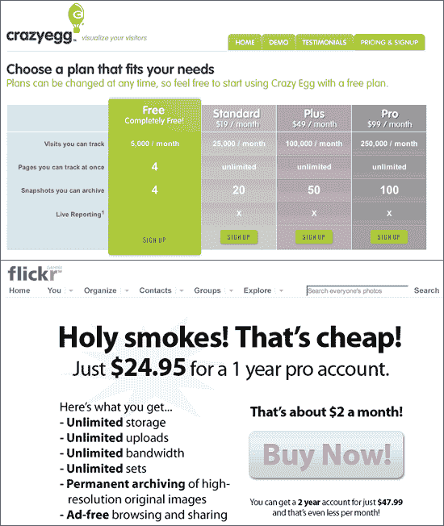

# 网络应用 101:你的三点成功计划

> 原文：<https://web.archive.org/web/http://www.techcrunch.com:80/2007/03/22/web-apps-101-your-three-point-success-plan/>

构建 web 应用程序很容易。构建一个成功且有利可图的网络应用是大多数人失败的地方。

在这个新的系列文章中，我将分享构建成功的 web 应用程序的有价值的策略和技巧。我将涵盖一切，从强大的营销策略，如何建立一个高质量的团队，伟大的客户支持技巧，最后，退出策略。

构建一个 web 应用程序与推出任何其他产品没有什么不同——它需要有坚实的商业原则作为支撑。你需要资金、真正的观众、可靠的盈利模式、营销计划、质量支持和良好的项目管理。

**三大命门**

如果你想让你的应用远离[死池](https://web.archive.org/web/20220727161925/http://www.beta.techcrunch.com/tag/deadpool)，你需要知道以下问题的答案:

1.  针对的是谁？
2.  他们为什么要用它？
3.  他们会付钱吗？

**# 1——针对谁？**

在你花费任何时间或资源之前，确切地知道*你的应用针对谁是至关重要的。小企业主？全职爸爸？说西班牙语的？30 岁以下的男性？没关系，只要你知道他们是谁。*

我相信一些最好的应用来自于满足你自己的需求。如果你发现自己在想，“哇，我肯定可以用……”那么这可能是一个绝佳的网络应用机会。

然而，如果你不是你的 web 应用程序的目标用户，就要格外小心。很容易对你的观众的需求做出错误的假设。记住你是一个早期采用者，在技术上比普通人更先进。在许多情况下，90%的客户会认为“互联网”是他们桌面上的蓝色“e”图标。

**# 2——他们为什么会使用它？**

你可能会有一个惊人的想法。也许它会帮助忙碌的妈妈们整理她们的购物清单。太好了。但是忙碌的妈妈们真的*需要那个吗？他们甚至想要它吗？*

这里有一些免费的市场调查，你可以用来确定人们是否会使用你的应用:

1.  询问你信任的人。他们的第一反应是什么？
2.  搜索与你的想法相关的术语。如果有很多关于它的在线活动，你就有了一个很好的机会(而且你可能会有竞争对手要对付)。
3.  确保实用。想象一下有人真的在使用这个应用程序。如果在实际使用中有任何事情看起来很尴尬，那么要非常小心。
4.  与你的潜在客户互动。和他们交谈，和他们一起出去，参加他们的在线论坛——让他们告诉你他们需要什么。

在把辛苦赚来的时间和金钱投入到一个项目之前，确保你的应用程序有真正的需求是最重要的事情。

**# 3——他们会为此买单吗？**

这是橡胶与路面相遇的地方。你可以瞄准你的目标客户，知道他们迫切需要这个应用，但是如果他们不愿意为这个该死的东西付钱，你就有麻烦了。

这是一个有用的测试:闭上你的眼睛，想象你是你的潜在客户之一。从他们醒来的时候，到他们看到你的网络应用的时候，带你走一遍他们典型的一天。

想象他们来到你的“定价和注册”页面。他们会如此确信他们需要你的服务，以至于他们真的会掏出钱包，输入他们所有的细节吗？如果是，他们愿意支付多少？

如果你的应用是针对企业主的，他们将能够负担得起每月 49 到 99 美元的支出。如果你的应用是针对 15 岁的孩子，你最好找到一个广告盈利模式。

**走自由路线**

如果你正在开发一个完全免费的应用程序(YouTube 和 digg 就是很好的例子)，你通常有两个赚钱的选择:

1.  广告
2.  获得物ˌ获得

你不应该*计划*被收购。记住，99.9%的网络应用不太可能被 16.5 亿美元(甚至 500 万美元)收购。盈利应该是你的首要目标。

你需要有一个可行的、严肃的盈利计划。如果你被收购了，很好。别指望了。

现在是选项 1——广告。如果你有一个出售存货的可靠计划，这是一个很好的赚钱策略。

销售广告有三种选择:

1.  使用广告网络([联合媒体](https://web.archive.org/web/20220727161925/http://www.federatedmedia.net/)、[权利媒体](https://web.archive.org/web/20220727161925/http://www.rightmedia.com/)等)
2.  雇佣一个广告销售团队
3.  使用像 Google AdSense 这样的产品

广告网络很聪明，因为他们消除了销售广告的所有困难。不过这代价很高——你通常只能获得广告收入的 60%或更少。

下一个选择，雇佣你自己的广告销售团队，是一个已经被证实的销售你的广告库存的方法……但是这将会非常昂贵。你通常会看到每个销售人员的基本工资为 2 万美元，外加佣金。

如果你没有足够的资金来组建一个完整的广告销售团队，这里有一些在预算范围内的方法:看看你是否能找到已经在做广告销售的朋友，问问他们是否能为你做点兼职。他们可以得到佣金，所以对你来说没有财务风险。

最后一个选择，使用像 AdSense 这样的产品，只有当你的 web 应用程序将获得非常大的流量*并且*很大程度上是基于内容的(谷歌需要能够解析文本以提供相关广告)时才是可能的。

**定价——找到最佳点**

如果你决定对你的应用程序收费，确定你的价格会很困难。

每一个网络应用开发者都为定价而苦恼。你应该按月付费还是一次性付费？你应该提供免费计划吗？你应该用广告赚钱吗？

例如， [CrazyEgg](https://web.archive.org/web/20220727161925/http://www.crazyegg.com/) 和 [Flickr](https://web.archive.org/web/20220727161925/http://www.flickr.com/) 有两种截然不同的定价策略。

以下是一些确定定价模式的实用技巧:

1.  问问了解你的目标市场的人。他们会帮你决定他们要在你的想法上花多少可支配收入。
2.  使用电子表格来试验你的数字，并确定你在哪里实现了盈利。我已经创建了一个[简单的 Excel 电子表格](https://web.archive.org/web/20220727161925/http://www.carsonified.com/files/cash-flow.xls)，它将允许你玩不同的定价方案数字，并观察对你的利润的影响。这很简单，但它应该给你一个总的指导方针。
3.  如果你打算通过广告赚钱，确保你有办法销售这些广告。你可能需要一个全职的广告销售人员。不要指望仅仅依靠一些谷歌广告就能盈利。
4.  使用促销代码让用户从免费升级到付费计划。每当我们为 DropSend 用户提供第一个月 50%的折扣时，我们都会看到大量的升级。

我得到的关于定价的最好建议来自 37signals 的 Jason Fried。我让他看了一下我们的定价结构，他灵机一动。过了一会儿，他说:“确保你的免费计划不会泄露太多。因为如果没人升级，你就麻烦了。”

如果你决定提供一个免费的计划，只让你的用户尝一尝，让他们饿肚子。

我决定分享 DropSend 付费用户的百分比，这样你就可以看到一个真实的例子:

*   5 美元/月计划:总收入的 13%
*   9 美元/月计划:总收入的 17%
*   19 美元/月计划:总收入的 20%
*   99 美元/月计划:总收入的 50%

那么你在经济上可行吗？

如果你能够回答这三个至关重要的问题，并且你选择了一个盈利模式，让你的现金流量表盈利，那么你就有很好的机会生存下来并变得盈利。

请随意分享您在构建 web 应用程序时学到的任何经验，或者挑战我提出的一些观点。

**下次……**

在 Web Apps 101 的下一期中，我将分享关于资助你的应用程序、建立成功的团队和项目管理的有价值的技巧。

*这篇文章是由[瑞安·卡森](https://web.archive.org/web/20220727161925/http://www.carsonified.com/about/)写的，他是[卡森系统](https://web.archive.org/web/20220727161925/http://www.carsonsystems.com/)的主管，这是一家总部位于英国的网络应用和活动公司。*