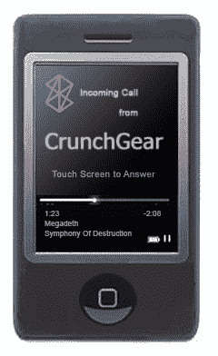

# 欢迎来到社交网站:Zune 手机风格——TechCrunch

> 原文：<https://web.archive.org/web/http://techcrunch.com/2007/02/01/welcome-to-the-social-zune-phone-style/>

# 欢迎来到社交:Zune 手机风格

随着[关于微软回应](https://web.archive.org/web/20210301062731/http://crunchgear.com/2007/02/01/source-microsoft-zune-phone-in-the-works/#more-3981) [iPhone](https://web.archive.org/web/20210301062731/http://www.apple.com/iphone/) 发布可能推出 Zune 手机的新闻，我们想知道他们最想拥有什么功能。

Zune 最独特的元素之一是其无线和社交分享音乐的能力。“嘿，趁我跟你通电话，你想听听那首新的《胫骨》吗？让我拍给你看……”

似乎微软已经预见到了移动通信的这一概念，即使是那些没有额外数据线的移动通信，如各种 [3G 格式](https://web.archive.org/web/20210301062731/http://www.roughlydrafted.com/RD/RDM.Tech.Q1.07/93CA0BF6-6296-4DCF-88EA-9E27E617E96A.html)中的数据线。2005 年，微软为[申请了两项](https://web.archive.org/web/20210301062731/http://www.patentmonkey.com/PM/PatentID/20070010264.aspx) [专利](https://web.archive.org/web/20210301062731/http://www.patentmonkey.com/PM/PatentID/20060270388.aspx)，允许在通话过程中传输富媒体，并使用 [DTMF](https://web.archive.org/web/20210301062731/http://en.wikipedia.org/wiki/DTMF) 信号通过语音信道(通常用于拨号的按键音)传输。

非常巧妙的东西，其中一个应用程序描述道,“数字“0”到“7”的标准 DTMF 信号可以被映射成这些数字的相应的三位二进制表示。任意数据可以被放置在具有元数据的容器中，该元数据指示数据的开始和结束、数据类型、数据量、纠错/检错信息等。接收器可以防止 DTMF 信号被转换成音频信号，以避免任何人类听众听到 DTMF 信号。”

同样，回到 2005 年 7 月，微软玩弄了另一项发明来简化多功能手机体验:一个[转换媒体设备](https://web.archive.org/web/20210301062731/http://www.patentmonkey.com/PM/PatentID/20070010264.aspx)(实际上，他们用这个名字命名了专利申请)。在这里，他们讨论了避免通过滚动多个界面菜单来获得所需功能的想法。这个想法围绕着设备的物理旋转方向，以访问其使用的各种功能-作为电话，相机或媒体设备。微软有相当多的[产品组合](https://web.archive.org/web/20210301062731/http://www.patentmonkey.com/PM/FolderID/c8c9bb178bad4ac2a18ed241c70f9c15.aspx)需要整理，我们将在未来的条目中报道更多。

【专利猴】是我们在[PatentMonkey.com](https://web.archive.org/web/20210301062731/http://www.patentmonkey.com/)的朋友写的一个特写