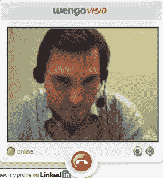

# 面向博客的 Wengo 视频聊天

> 原文：<https://web.archive.org/web/http://www.techcrunch.com:80/2006/12/21/wengo-video-chat-for-bloggers/>

# 面向博主的 Wengo 视频聊天

 [法国第二大电信公司 9 Telecom 的子公司 Wengo](https://web.archive.org/web/20220807133935/http://wengo.com/) ，为博主们设计了一款设计精良的聊天小工具。它叫做 [Wengo Visio](https://web.archive.org/web/20220807133935/http://wengovisio.com/) ，类似于 [MeeboMe](https://web.archive.org/web/20220807133935/http://www.beta.techcrunch.com/2006/08/02/meebo-launches-meebome/) ，但带有视频聊天功能。Visio 通过一些嵌入式 JavaScript 和 CSS 在 Flash 中运行，使用 [SIP](https://web.archive.org/web/20220807133935/http://en.wikipedia.org/wiki/Session_Initiation_Protocol) 作为通信协议。查看[这里](https://web.archive.org/web/20220807133935/http://www.wengovisio.com/index.php/homePage)的一些博客已经实现了它。

当您安装了 widget 后，您可以通过管理菜单登录来聊天。当在线时，读者可以通过在显示在所有者一侧的文本框中输入一条小消息来邀请你聊天。然后，如果他们愿意，所有者可以发起聊天。目前聊天是通过麦克风和可选的网络摄像头一对一进行的，这使得它不像 MeeboMe 那样令人难以招架。虽然，PalTalk 的群组视频聊天和读者收听的能力可以在你的博客上形成一个特设的“吉尔摩帮”式的思想会议。

但 Wengo Visio 并不打算成为一个独立的程序，而是努力向更广泛的受众展示 Wengo 的其他产品、Wengo Talents community 和 Wego Phone。Wengo Phone 是他们自己的聊天客户端，可以让您进行文本聊天、呼叫其他 VOIM 用户、拨打座机、拨打手机、设置音频会议以及进行视频通话。它也可以在 Win、Mac 和 Linux 上运行，兼容 Google Talk、Yahoo、ICQ 和 GAIM。与 Skype-out 类似，它们只对拨打座机和手机收费，但在 1 月 4 日之前可以免费试用€ 0.50 英镑的信用点数。到目前为止，超过 7200 万分钟已经在 Wengo 上分享。

退一步说，Wengo Visio 和 Wengo Phone 都是他们建立按通话付费专家网络 Wengo 的长期计划的一部分，人们可以通过 PayPal 或信用卡在电话上出售他们的时间。这听起来可能很像 [Ether](https://web.archive.org/web/20220807133935/http://www.beta.techcrunch.com/2006/06/22/ether-pay-per-call-launches-for-public-use/) ，没有 1-800 号码，而且非常相似。然而，Wengo 选择围绕他们自己的 Wengo 社区网站提供服务，用户可以在那里对自己进行分类，获得评级，并发布个人资料。以太选择了不同的策略，依靠用户自己来推广服务。