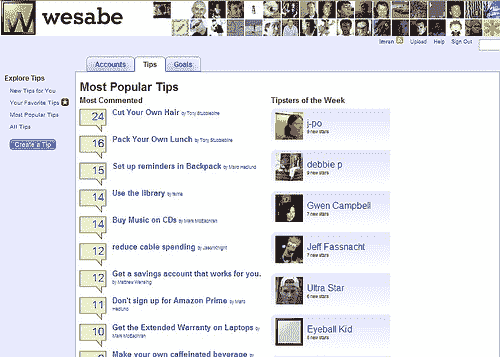
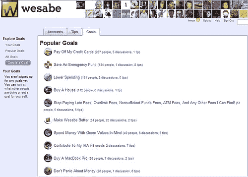

# Wesabe 钱的线索 2.0？TechCrunch

> 原文：<https://web.archive.org/web/http://techcrunch.com:80/2006/11/29/wesabe-clues-for-money-20/>

好了，好了，不再有 2.0 的“陈词滥调”:

几个星期以来，我一直在急切地等待(不要与[核山葵](https://web.archive.org/web/20150909080533/http://www.urbandictionary.com/define.php?term=wasabi))的发射。首先，这是一个有趣的概念；其次，联合创始人之一是马克·赫德伦德(Marc hed Lund)——O ' Reilly Media 的常驻企业家，也是《关于为极客提供风险投资*的娱乐性和知识性极强的演讲》的作者。*

 *Wesabe 本质上是通过匿名化、汇总和分析用户的个人财务数据，并将其与其他 Wesabe 用户的数据进行比较，帮助用户找出可以省钱的地方，更好地管理自己的财务。用户可以在他们的消费(午餐、电影等)中标记每个条目。)，为自己设定[目标](https://web.archive.org/web/20150909080533/http://feeds.feedburner.com/~r/WheatiesForYourWallet/~3/52798541/)并标记他们的支出条目，以便从其他用户那里找到提示和共享目标。

Wesabe 是一个很棒的概念——对你的钱来说是 43 件事情——观察这个社区如何随着时间的推移而演变将会很有趣。用户们已经在分享有用的提示和建议，其中许多显而易见，但是从另一个有着相似生活方式的人那里听到这些还是很有价值的。或许有了未来的声誉，这些提示可能非常可信。

尽管 Wesabe 是一家美国初创企业，但它突显了英国金融服务业与英国初创企业之间的差距。英国是世界上金融业专业人才最集中的国家之一，比起现金，英国人更喜欢数字交易(而且负债累累！)然而，全球的财政中心并没有催生出新一代的金钱 2.0 创业公司——比如 [*【比尔蒙克】*](https://web.archive.org/web/20150909080533/http://www.billmonk.com/)*[ChipIn](https://web.archive.org/web/20150909080533/https://www.chipin.com/)**[FEED Tribes](https://web.archive.org/web/20150909080533/https://www.feedtribes.com/)**[Fundable](https://web.archive.org/web/20150909080533/http://www.fundable.org/)**[Prosper](https://web.archive.org/web/20150909080533/http://www.prosper.com/)*[*TextPayMe*](https://web.archive.org/web/20150909080533/https://www.textpayme.com/)甚至

 *这是金融领域保守主义的结果，还是基于社交和娱乐的 Web 2.0 服务的魅力和浮华，或者仅仅是美国初创公司卓越的创业能力。具有讽刺意味的是，一个例外是由来自巴克莱、乐购个人金融、Abbey 和 Egg 的前副总裁和高管创立的 Zopa 当然，在第一次互联网热潮中，后者引领了网上银行和贷款领域的许多创新。

也许会有一个结构性的变化，有助于推动事情向前发展。Wesabe 已经表明，从我们的银行中分离我们的银行数据有助于创造新的价值和用途领域——巧合的是，Marc 在 Web 2.0 上主持了一个关于开放数据的[小组讨论。或许，如果银行开始提供平台服务，比如](https://web.archive.org/web/20150909080533/http://blog.wesabe.com/index.php/2006/11/10/open-data-at-web-20-and-our-data-bill-of-rights/)[你当前账户的安全 RSS 源](https://web.archive.org/web/20150909080533/http://imran.typepad.com/blog/2006/07/do_dinosaurs_rs.html)，它们可以帮助引入一个创新服务的生态圈，为自己的业务增值，为他人创造增长……或许随着这些初创企业的蓬勃发展，为自己创造未来的收购机会。

几年前，[达芬奇研究所](https://web.archive.org/web/20150909080533/http://www.davinciinstitute.com/home.php)举办了一次关于*货币未来*的峰会——我认为这可能是一个重温这些主题的有趣时机:)**