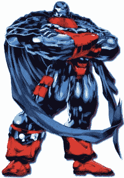

# 你是哪个超级英雄？–TechCrunch

> 原文：<https://web.archive.org/web/http://www.techcrunch.com:80/2006/12/29/what-superhero-are-you/>

极客们绝对喜欢漫画书和超级英雄，这就是为什么这个简单的网站会根据几个问题告诉你[你是什么样的超级英雄](https://web.archive.org/web/20220112003209/http://www.thesuperheroquiz.com/)，自推出以来已经有超过 1200 万的点击量。我很想成为蝙蝠侠或蜘蛛侠，但我诚实地回答了问题，并提出了绿灯侠。我一点也不高兴我是 45%的神奇女侠。

虽然我只有 70%的绿灯侠。[杰森·卡拉卡尼斯](https://web.archive.org/web/20220112003209/http://www.calacanis.com/2006/12/29/im-green-lantern-but-you-knew-that-already/)是 75%的绿灯侠，所以我猜他比我更鲁莽。戴夫·温纳是钢铁侠。史蒂夫鲁贝尔是超人。你是哪个超级英雄？

你的结果:
**你是绿灯侠**

| 

&#124; 绿灯侠 &#124; 

* * *

 &#124; 70% &#124;
&#124; 浩克 &#124; 

* * *

 &#124; 65% &#124;
&#124; 小兵 &#124; 

* * *

 &#124; 65% &#124;
&#124; 闪光灯 &#124; 

* * *

 &#124;  &#124;
&#124; 钢铁侠 &#124; 

* * *

 &#124; 40% &#124;
&#124; 猫女 &#124; 

* * *

 &#124; 35% &#124;
&#124; 超女 &#124; 

* * *

 &#124; 35% &#124;
&#124; 超人 &#124;

 | 头脑发热。你有坚强的意志力和丰富的想象力。
 |

 [点击此处参加超级英雄性格测试](https://web.archive.org/web/20220112003209/http://www.thesuperheroquiz.com/)
 **更新:**有人在评论中直指[反派](https://web.archive.org/web/20220112003209/http://www.thesuperheroquiz.com/villain/)妹子站点。我也参加了那个测试。我觉得反派那个其实更好玩。

你的结果:
**你是天启**

| 

&#124;  &#124; 

* * *

 &#124; 91% &#124;
&#124; 末日博士 &#124; 

* * *

 &#124; 88% &#124;
&#124; 万磁王 &#124; 

* * *

 &#124; 83% &#124;
&#124; 黑凤凰 &#124; 

* * *

 &#124;  &#124;
&#124;  &#124; 

* * *

 &#124; 71% &#124;
&#124; 绿魔 &#124; 

* * *

 &#124; 68% &#124;
&#124; 冰冻先生 &#124; 

* * *

 &#124; 67% &#124;
&#124; 毒液 &#124;
&#124; 神秘感 &#124; 

* * *

 &#124; 40% &#124;
&#124; 谜语 &#124; 

* * *

 &#124; 30% &#124;

 | 你相信适者生存，你相信自己是最适者。
 |

 [点击这里参加超级反派性格测试](https://web.archive.org/web/20220112003209/http://www.thesuperheroquiz.com/villain)