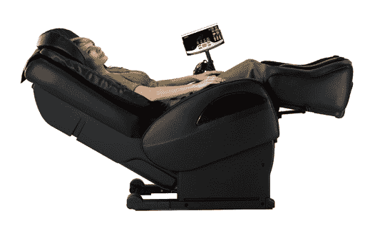

# 我们在 CES 上错过了什么:三洋的东西

> 原文：<https://web.archive.org/web/http://techcrunch.com/2007/01/17/what-we-missed-at-ces-sanyo-stuff/>

# 我们在 CES 上错过了什么:三洋产品

由于一些严重的日程安排疏忽，当我们在 CES 上闲逛时，不知何故错过了三洋。由于我们的疏忽，我们错过了三洋展示的两款截然不同的产品:Sprint Power Vision M1 和零重力按摩椅。

虽然我肯定在 CES 上看到了我的手机，但我肯定可以坐在椅子上(尽管我可能太害怕坐在那些油腻的 CES 上)。那么这些新产品是怎么回事呢？

。三洋声称它可以用这款有线耳机玩 18 个小时。我不确定那是不是在打电话的时候，所以我不会评论那是好是坏。

M1 还配有一个 200 万像素的摄像头，可兼作 QVGA 摄像机。哦，它还可以用作调制解调器，只要 Sprint 决定不禁用它。标准两年期交易的价格为 200 美元，或者直接为 350 美元。

继续往前走，我们有零重力按摩椅。它可以通过三洋的硬度检测传感器技术(嗯嗯嗯)测量脉搏和汗液的变化来定位硬度区域，这与测谎仪使用的皮肤电反应类似。一旦它检测到你的僵硬，它可以根据它的发现定制按摩。它有两个“零重力位置”,可以完全无压力地坐着。大约有 1000 种不同的按摩方式，所以我不会一一列举，只想说你想要一种。

HEC-DR7700K 将于今年春季晚些时候上市。目前还没有价格，但从它的前身 4，300 美元的价格来看，我可以大胆地说，这款零重力椅将会非常昂贵。

[三洋](https://web.archive.org/web/20201026013751/http://www.sanyo.com/)