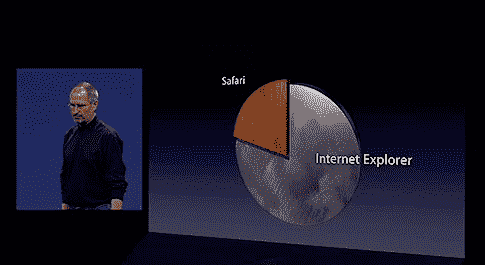

# 牛肉是什么？Mozilla 首席运营官指责苹果对互联网持旧世界观点

> 原文：<https://web.archive.org/web/http://techcrunch.com:80/2007/06/15/whats-beef-mozilla-coo-accuses-apple-of-having-old-world-views-of-the-internet/>

# 牛肉是什么？Mozilla 首席运营官指责苹果对互联网持有旧世界的观点

还记得周一，史蒂夫·乔布斯，我们这个世界的统治者，[宣称](https://web.archive.org/web/20130628200447/http://crunchgear.com/2007/06/12/video-of-steve-jobs-wwdc-2007-keynote-now-available/) Safari 是有史以来最好的浏览器，苹果公司想从 ie 浏览器那里抢走市场份额吗？Mozilla 的首席运营官也注意到了这一点，但一点也不喜欢。所以他把苹果叫了出来。

在他的个人博客上，约翰·莉莉质疑乔布斯对互联网工作方式的看法。他说，自上而下的模式驱动信息流动的时代已经一去不复返了，一两个浏览器主宰网络浏览器的时代已经一去不复返了。有足够的空间安装 ie、Safari、Firefox、Opera 等。可以说，苹果想要“控制”相对于 Safari 的互联网是旧思维方式的一部分——新的思维方式是维基百科、知识共享、Linux 等等。换句话说，是以人为本。苹果“Safari 将统治一切”的口头禅已经过时了。

当然，对于乔布斯希望 Safari 尽可能做到最好，Lilly 没有任何意见。谁能？更好的浏览器会带来更好的浏览器。每个人都赢了。但是认为网络注定会成为一场双方的消耗战是愚蠢的。

我想知道苹果和——见鬼，似乎每个人都是这样，不是吗？—终于结束了？

一张图片值 1 亿用户？？？【约翰的博客通过 [Macworld UK](https://web.archive.org/web/20130628200447/http://www.macworld.co.uk/news/index.cfm?RSS&NewsID=18310) 】