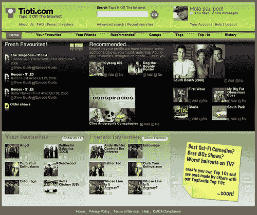
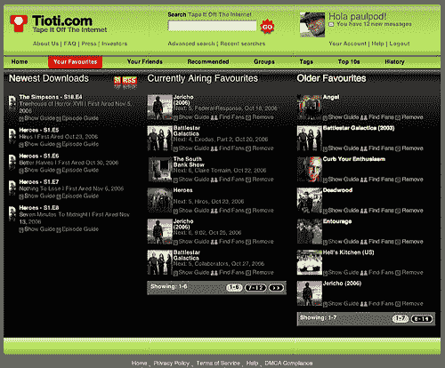
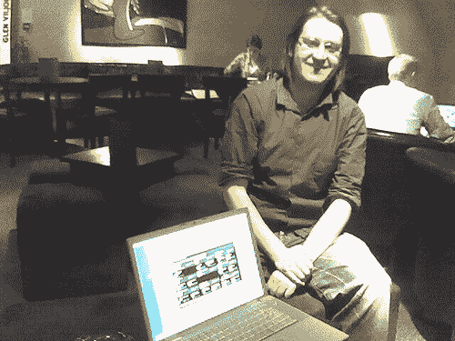

# 今晚上演什么？直接从网上录下来| TechCrunch

> 原文：<https://web.archive.org/web/http://techcrunch.com:80/2006/11/01/whats-on-tonight-just-tape-it-off-the-internet/>

保罗·克莱格霍恩在人群中发出阵阵窃笑。

在 NMK 举行的一场名为[聚合者和颠覆者](https://web.archive.org/web/20140706230248/http://www.nmk.co.uk/event/2006/10/17/beers-innovation-aggregators)的活动中， [Tape It Off The Internet](https://web.archive.org/web/20140706230248/http://www.tioti.com/) 的联合创始人以一种看似“悠闲的设计师”的态度，逗乐了那些聚集在一起的人们，面对迷宫般的文件共享和商业下载世界，如今视频内容正在填满互联网的“边缘”。“我们会解决的，”他漫不经心地说。

尽管外表如此，他的论文却是极其严肃的。他认为，电视的广告资助模式意味着，向网络的过渡将与音乐产业因拒绝解决网络问题而遭遇的大屠杀截然不同。

上周，当我们在伦敦亚当街(Adam Street)俱乐部的深处见面时，他重复了这个观点:“电视一直是广告资助的媒体，所以我们正在考虑帮助它在网上存在。TIOTI 将成为一个实验室来测试这个理论和新的想法。

看起来他会抓住一切机会这样做。自从最近被主流媒体报道以来， [TIOTI](https://web.archive.org/web/20140706230248/http://www.tioti.com/) 已经经历了一波 beta 阶段的注册潮。事实上，数量如此之多，以至于在 Telewest 在他家停机一天后，保罗醒来时发现他的收件箱里有 1000 多封电子邮件。

TIOTI 的目标似乎是成为第一个基于电视的“社交媒体聚合器”,这可能比这个令人费解的名字更受欢迎。它似乎已经利用了用户被压抑的分享和发现电视节目的愿望，采用了一些 Web 2.0 技术，如标签和用户评级。

所有这一切的背景故事，将会触动任何看过电视、意识到全球节目发行时间表是新互联网经济所厌恶的人熟悉的心弦。33 岁的 Cleghorn 在对美剧《白宫风云》在英国播出时间过长感到沮丧时，受到了启发，开始创作《TIOTI》。他正确地推测，与其经历托管实际视频的法律纠纷，一个好的开始方式是简单地从 BitTorrent 搜索引擎、苹果的 iTunes 商店和不断增长的可下载电视资源中提取内容。

他在一年前设计了这个网站，当时 BitTorrent 是在线电视的主要来源。然而，正如他所说的，“今年是一个完全的转变，电视网络和版权所有者现在意识到电视的长尾可以让你从 T3 中赚钱。电视是一个如此浪费的行业，他们意识到在网上提供内容的进入成本现在是如此之低，他们可以很容易地发布节目。这验证了[克里斯·安德森的长尾理论](https://web.archive.org/web/20140706230248/http://www.thelongtail.com/)

TIOTI 最初是一个开发博客，它从标记和单一目录的角度讨论信息架构。过了一段时间，这个网站变成了一个页面，上面有一个注册邮箱，公司成立于 2005 年。

但真正的工作始于今年 3 月，乌克兰的一个开发团队(“欧洲情感和价格的最佳组合”Cleghorn 说)。迄今为止，一切都是在“血汗资本”的基础上完成的。在至关重要的融资领域，TIOTI 目前正在与不止一个未透露姓名的潜在投资者进行谈判，以期获得营销和下一阶段开发的资金。

克莱格霍恩与西雅图的同事马克·柯兰多(Marc Colando)共同创立了这家美国公司，他们是在 Razorfish[网络代理公司的鼎盛时期在伦敦相遇的。](https://web.archive.org/web/20140706230248/http://en.wikipedia.org/wiki/Avenue_A/Razorfish)

Cleghorn 上个月才辞去了 Aggregator.tv 的日常工作，专注于 TIOTI。在 TIOTI 之前，他经营设计机构 Neuromantics，在此之前，他在 Poke、Razorfish、BT Research Labs 和 Xerox 担任高级设计职位。

但他在聚合领域有“形式”。Cleghorn 在视觉设计、信息架构和设计策略方面拥有超过 10 年的经验，曾参与 Aggregator.tv、诺基亚、BBC、Orange 和沃达丰的聚合领域相关项目。(Aggregator.tv 是一个高质量的视频点播服务，很快将推出名为 [Moe.tv](https://web.archive.org/web/20140706230248/http://www.moe.tv/) 的新俄罗斯在线电视服务)

Colando 以前经营 Interactive Planet Inc，为包括美国银行、可口可乐公司、Earthlink、Equifax、柯达、美国海军陆战队和沃达丰在内的客户开发网站和内部网。

就其追踪的来源而言，TIOTI 搜索的三个主要商业领域是 iTunes、T2 AOL 视频和 T4 亚马逊的 Unbox 服务。尽管亚马逊和 Unbox 不提供可用的 RSS 提要，TIOTI 已经编写了独立于页面设计的软件——**智能屏幕抓取**——来获取它需要的信息。

TIOTI 的核心是其细长的黑色界面——值得注意的是，Cleghorn 更像是设计师而不是程序员——以及社交体验，它具有类似 iPod 的易用性。(具有讽刺意味的是，克莱格霍恩的昵称是“保罗·波德”——尽管这比无处不在的 MP3 播放器还要早)。

TIOTI 后端构建在 Java 2 Enterprise Edition(J2EE)Spring 框架上，并使用开源产品，如 Apache Tomcat 和 MySQL。可用的工具包括电视指南和剧集数据，使用户能够编写和编辑评论，并从他们的偏好中提取 RSS 订阅，以跟踪他们想要的节目。

利基社交网站的优势在于人们对它充满热情，他们希望参与进来，为它增添更多东西。现在我们有一点元数据，但测试人员告诉我们，他们希望我们为节目添加更多内容，例如关于节目的维基百科链接、官方电视指南、从 Fickr 等地方拉协作内容。或者链接到同人小说网站，”克莱格霍恩说。

主用户主页显示推荐，右边区域注定成为富媒体广告的主要区域。Cleghorn 说:“这里的视频广告应该比平面报纸上的广告更有上下文感。”他透露，他们的基线收入目标包括目前高达 35 英镑/cpm 的丰富媒体广告。

TIOTI 还会根据用户的评价向他们提出建议。每个节目和剧集都可以推荐给其他用户，进行评分，与他人讨论，有点像在社交网站上浏览“朋友的朋友”网络，可以看到其他用户对哪些节目进行了评分。

TIOTI 前端使用 AJAX 使用户体验更加流畅。所有的节目和剧集数据都可以通过维基风格的编辑引擎进行编辑，并且系统可以提供各种各样的 RSS 源。用户讨论板和现场用户对用户的消息传递也是活跃的特征。

也有一些有趣的方法将内容从网站中提取出来。例如，用户可以使用开源的[民主播放器](https://web.archive.org/web/20140706230248/http://www.google.com/url?sa=t&ct=res&cd=1&url=http%3A%2F%2Fwww.getdemocracy.com%2F&ei=CmVIRcPZB83YRr6dodIO&usg=__jehN29LQiRaH36y_g83pfGcHWhU=&sig2=cUQ7OD621r5j_3jGUGHdDw)，它有一个 RSS 阅读器，一个 BitTorrent 客户端和 VLC 播放器。人们可以将 TIOTI 的视频粘贴到 Democracy Player 中作为一个新的频道，并自动观看它下载的节目，甚至是一整季。Cleghorn 透露，他们甚至正在与苹果讨论将该网站与 iTunes 整合。

TIOTI 目前正在接受 2000 多名测试用户的测试，有 12000 名用户排队邀请加入，它还链接到亚马逊等零售商发布的新 DVD。它现在正在索引超过 1，600 个电视节目和近 90，000 集。然而，Cleghorn 表示“没有理由”不能指向 DVD 租赁公司，如 Blockbuster、LoveFilm 和 ScreenSelect。

事实上，**他看不出为什么 TIOTI 有一天会通过网站**播放这些节目。“一个很好的例子是 BBC，它的使命是以正确的方式向尽可能多的人提供节目，例如关于地理的节目，所以这应该不是什么大问题，”Cleghorn 说。

他认为 TIOTI 是通过录像机的简单时移电视的一个进步，也超越了视频点播。因为通过聚合来自各种电视指南和下载来源的信息，它有效地为用户做了“远程翻转”:“如果你喜欢的话，就像互联网上的 TiVo 一样”。

联合创始人 Colando 认为，由于内容所有者试图将他们的电视节目整合到自己的网站上，电视市场变得更加细分，TIOTI 有一个很好的机会将所有的时间表，发布日期和下载资源整合到一个品牌下。

"我需要知道维亚康姆制作了一个特别的节目吗？"克莱格霍恩解释道。“再加上亚马逊(Amazon)Unbox、iTunes、美国在线(AOL)等零售商，以及谷歌视频/YouTube、Brightcove 等即将推出的商店……每一家都有技术和地理限制，你会开始看到一个非常细分的市场。”

看来他说得有道理。对潜在竞争对手的观察显示，其他网站可能会做一些 TIOTI 做的事情，但不是全部。YouTube 在聚合用户生成内容的同时，正迅速成为专业制作的电视节目的沙漠，因为法律行动夺走了大量内容。苹果商店上的电视节目仍然在低数量中萎靡不振，而工作室正在研究下一步该做什么。

克莱格霍恩说:“许多人正在做我们正在做的事情的一部分，但迄今为止，没有人加入我们所有的点”。他嬉皮笑脸地补充道:“从大的方面来看，《广播时报》【英国领先的电视指南】**应该做这件事**，但他们没有，所以我们将为他们做这件事，并卖给他们一个白色标签许可证！”

更严重的是，他补充道:“我们认为我们可以把社交空间做得更好，并为用户生成的电视节目内容提供更好的工具。”然而，他承认他们“**正在关注威尼斯项目**”，由 Skype 前创始人发起的 P2P 电视项目。

TIOTI 所做的最有争议的方面可能是提醒用户可以从 BitTorrent 或其他文件共享系统下载新节目。Cleghorn 对此的回答是**他们“不认为 BitTorrent 还会存在很长时间**。我们会尽可能小心。我们总部设在美国，并签署了 DMC 安全港协议，我们不主持任何 BitTorrent 流，只是指向他们。我们离激流只有两步之遥。”

Cleghorn 相信电视的“napsterisation”不会真的发生:“**发生在音乐上的事情不会发生在电视上**，因为音乐产业发展缓慢，并且拒绝承认，从第一天起就把我们都描绘成小偷。电视发展更快，思想更开放。电视也一直有广告支持，所以他们不太担心节目在哪里出现，只要他们以某种方式获得报酬。”

他认为，考虑到人们想要的 80%的内容只有 20%的内容，大型电视网将确保指向非法 BitTorrent 网站的法律问题会很快得到解决。然而，这听起来可能像是一厢情愿的想法，正如刚刚被收购的 YouTube 所发现的那样，律师仍然可以赚很多钱。

但是，就像另一位留着与视频相关的长发的互联网创始人，YouTube 的查德·赫利一样，通常保守的克莱格霍恩对蒂奥蒂的目标非常清楚。

带着“半开玩笑”的微笑和一丝布莱克浦出生的口音，他说:“我们正试图接管这里的世界。”