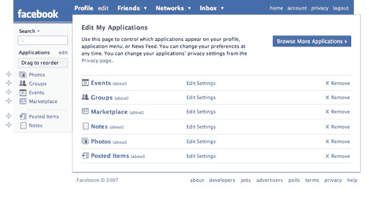

# 你最喜欢的脸书应用程序是什么？TechCrunch

> 原文：<https://web.archive.org/web/http://techcrunch.com/2007/07/17/whats-your-favorite-facebook-app/>

[脸书](https://web.archive.org/web/20160325183821/http://crunchgear.com/category/facebook/)和我已经不再说话，但今天的这些孩子确实喜欢他们的一些脸书应用程序。现在已经有两个，也许三个应用程序了,《连线》想知道——原因不明——你最喜欢的是什么。目前，谷歌阅读器共享项目应用以 29 票赞成、14 票反对领先。最不受欢迎的是 Shelfari，它会告诉你的朋友你在读什么。看起来大多数关于脸书的最受欢迎的书籍都是直接从高中必读书目中删除的，我想说阅读对脸书人群来说并不完全是一种受欢迎的消遣。我猜他们正忙着上传“狂野”和“疯狂”的照片。

如果我能设计一个应用程序，我会让它记录每天在 CrunchGear 聊天室里有多少下流的、近乎不恰当的笑话。一天最多四五次。我发誓。

[投票:脸书最不可或缺的应用](https://web.archive.org/web/20160325183821/http://blog.wired.com/monkeybites/2007/07/vote-facebooks-.html)【编译 Wird 博客】