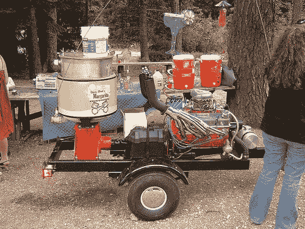

# 当哥斯拉需要一杯玛格丽塔鸡尾酒时

> 原文：<https://web.archive.org/web/http://techcrunch.com/2007/06/20/when-godzilla-needs-a-margarita/>

我想让你见见唐。唐是萨拉的叔叔，他有点古怪，喜欢做东西。唐酷爱吉米·巴菲特和玛格丽塔酒，所以他建造了世界上最快的玛格丽塔机。它位于一辆拖车上，拖车上有一个小型汽车发动机，为一台 6 加仑的搅拌机提供动力。看起来它的设计意图是*让一半的罗德岛人喝醉*。

没有配方，一个巨大的玛格丽塔鸡尾酒机有什么用？唐有备而来，在他的装置中加入了以下成分，以确保每个人在一小时内都被浪费掉:

> 加:6 袋冰块，18 瓶即饮玛格丽塔鸡尾酒。打开点火开关，转动发动机 10 至 20 秒。打开阀门，尽情享受。

等等，没有龙舌兰酒？我很确定有人趁唐不注意往里面倒了 12 瓶顾客银。这东西一定会在大学橄榄球赛上大受欢迎。要是唐能批量生产这些东西就好了！
[肮脏的唐玛格丽塔制造者](https://web.archive.org/web/20150930061818/http://www.makezine.com/blog/archive/2007/06/dirty_dons_margarita_make.html?CMP=OTC-0D6B48984890)【制造】