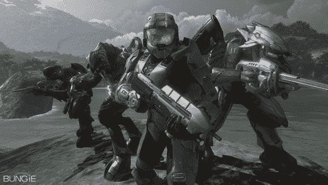

# 谁不爱 42 盎司的光环 3 主题汽水？TechCrunch

> 原文：<https://web.archive.org/web/http://techcrunch.com:80/2007/08/09/who-doesnt-love-42-ounce-halo-3-themed-soda/>

微软将于 9 月 25 日发布《光晕 3》,距离现在只有 7 周时间，而男孩计划在市场上大展拳脚。它有几个合作伙伴，所以无论你去哪里，你都会以某种方式遇到士官长。到目前为止，微软已经招募了以下公司来帮助使 *Halo 3* 成为它所希望的系统销售商。

汉堡王:大得吓人的饭菜和杯子(水壶？)的汽水将在九月出售，上面有游戏的标志和酋长的头像

百事可乐:一种叫做“激浪游戏燃料”的全新饮料，增加了一点樱桃味，比普通激浪多 30%的咖啡因

7-11:士官长思乐冰杯

通用汽车公司:哦，你知道，只是一款全新的汽车，G6 GXP 街，目标客户是购买这款游戏的年轻男性

或者，以有声图片的形式…

所以不管你喜不喜欢，光晕 3 将会成为未来几周流行文化的一部分。有趣的是，我们对《毁灭战士》的翻拍变得如此兴奋。

[又来了《光晕 3》——
外加薯条](https://web.archive.org/web/20160422070601/http://online.wsj.com/article/SB118662363769092549.html?mod=hpp_us_editors_picks)【华尔街日报】