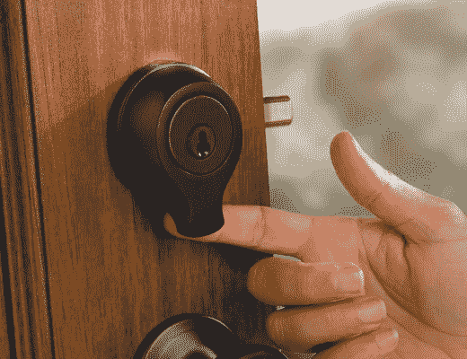

# 谁需要钥匙？SmartScan 生物识别扫描为我们的未来打开大门| TechCrunch

> 原文：<https://web.archive.org/web/http://techcrunch.com/2007/07/09/who-needs-keys-smartscan-biometric-scanning-opens-doors-to-our-future/>

关键是*所以*20 世纪。谁有时间把手伸进口袋，选择正确的钥匙，把它放在钥匙孔里，转动钥匙，把门推开？我当然不知道。这就是为什么，如果我有房子，我会看看 Kwikset 的 SmartScan 生物识别扫描开门解决方案。(如今一切都是解决方案。)手指轻轻一划，锁就开了，允许进入你的住所。你可以对 SmartScan 进行编程，让它在特定的时间使用你自己以外的手指(例如，你懒惰的孩子或你忘恩负义的妻子的手指)工作。

这种令人难以置信的技术会花掉你 200 美元。不包括机器人罗西。

[智能扫描](https://web.archive.org/web/20150510024801/http://www.kwikset.com/smartscan/smartScan.html)【Kwikset】