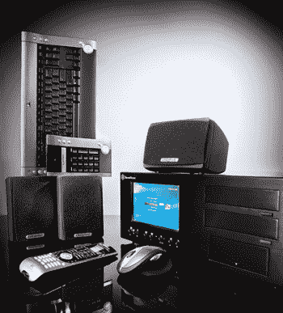

# 为什么 CableCARD 家庭影院电脑还没有起飞？

> 原文：<https://web.archive.org/web/http://techcrunch.com:80/2007/05/18/why-havent-cablecard-home-theater-pcs-taken-off/>

在 Zatz Not Funny，有史以来最伟大的博客名称上，Zatz 提出了一个重要的问题:cable card-ready PC 是怎么回事？是他们从地球上消失了，还是人们对在娱乐中心安装个人电脑的想法不感兴趣？

我是这样看的:有一群人对拥有一台家庭影院电脑(或 HTPC)并真正体验一场独一无二的娱乐盛会没有任何疑虑，然后有一些人前往[沃尔玛](https://web.archive.org/web/20130628154936/http://crunchgear.com/2007/05/14/skype-finds-its-way-into-wal-marts-necrotic-heart/)购买一个盒装家庭影院，并认为 50 美元的 DVD 播放器和几个塑料扬声器将重现前往电影院的快乐。尽管事实上剧院已经下了地狱(在一个篮子里)。

有了 CableCARD slot-ready PC，用户可以省去从当地电信公司或诸如此类的地方租用机顶盒的麻烦，可以从现在到下周二拥有存储空间，并且通过适当的软件，可以做任何 TiVo 或普通 DVR 能做的事情。怎么回事？为什么人们不在这上面跳呢？

会不会是普莱斯？扎茨指出，这样的个人电脑售价 1500 美元——无论如何都不便宜，但没有什么是不能在短短几个月内存起来的。与此同时，您可以找出如何最好地将 HTPC 集成到您的设置中。

或者是，不管出于什么原因，人们就是不想在他们的娱乐中心里放一台个人电脑？难道 [Mac mini](https://web.archive.org/web/20130628154936/http://crunchgear.com/2006/09/01/apple-updates-mini/) 的目标不应该是除了第一次使用 Mac 的用户之外，那些想要一个看起来不像垃圾的廉价 HTPC 解决方案的人吗？

至少在我看来，明智的选择是使用 HTPC。随着时间的推移，它会给你的“钱”带来最大的“回报”，而且你不会欠当地电信公司一辈子的债。

或者我只是太笨了。

有线卡电脑真的重要吗？【扎茨不好笑】