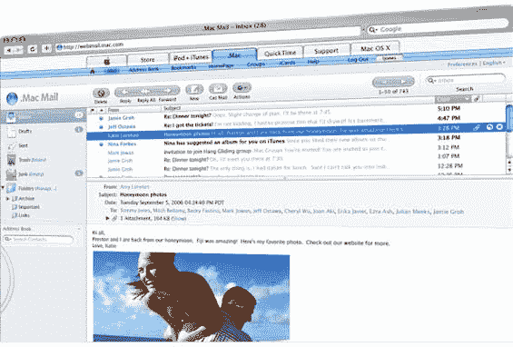

# 为什么是新的。Mac Webmail 很重要

> 原文：<https://web.archive.org/web/http://www.techcrunch.com:80/2006/09/29/why-the-new-mac-webmail-is-important/>

本周早些时候，苹果[宣布](https://web.archive.org/web/20230308103838/http://www.mac.com/1/webmail.html)面向 Mac 用户的新版网络邮件“即将推出”博客圈里有一些关于这件事的[闲聊](https://web.archive.org/web/20230308103838/http://www.techmeme.com/060928/p56#a060928p56)，大多数人认为这件新鲜的外衣是劣等的。mac 产品有点乏味。甚至[奥姆马利克](https://web.archive.org/web/20230308103838/http://software.gigaom.com/2006/09/26/dot-mac-going-web-20/)，他一直在抱怨。mac 很长一段时间，有理由欢呼，对宣布的升级不是特别积极，并说他希望“这是许多变化的第一步。”

我同意。mac 是苹果最难用的产品，需要做很多工作。然而，我认为这些变化很重要，原因只有一个:**现在很少有 Ajax webmail 服务允许用户访问多个电子邮件帐户。。Mac 将是其中之一。**

我相信 webmail 是展示 Ajax 威力的最重要的应用程序。原因是我们每天花在电子邮件上的时间多得令人难以置信——对我来说，每天至少 3-4 个小时。当我们花那么多时间做某件事时，即使生产率的微小提高也会产生巨大的积极影响。

Ajax 在 webmail 中有很大的不同，正如我们几年前在 Oddpost 中看到的那样。Oddpost 率先使用 javascript 来帮助它复制桌面邮件体验，是早期的 Ajax 应用程序之一。用户可以将电子邮件拖放到文件夹中，打开电子邮件而不刷新页面，等等。所有这些功能都极大地节省了时间。它有局限性(它只在 Windows 机器和 Internet Explorer 上运行)，但它在 2004 年被雅虎收购，并成为新的[雅虎邮件测试版](https://web.archive.org/web/20230308103838/https://techcrunch.com/2006/09/14/yahoo-mail-beta-to-open-to-the-public/)的主干(在这里试用)。

虽然其他 Ajax 电子邮件应用程序也存在(Gmail 有一些 Ajax 功能，但缺乏拖放功能，Live.com 邮件非常好，但往往很慢)，但除了雅虎，没有一个允许用户访问其他电子邮件帐户(值得注意的是 [Goowy](https://web.archive.org/web/20230308103838/https://techcrunch.com/tag/goowy) 有一个优秀的 Flash 电子邮件服务，允许用户访问多个电子邮件帐户)。如果你使用 Gmail，你只能阅读 Gmail 邮件。Live.com 也一样。虽然您可以将其他电子邮件转发到您的 gmail 或 live.com 电子邮件地址，但您不能管理单独的电子邮件帐户和别名。对于那些想在网上使用 Outlook 或 Mac Mail 的人来说，这是一个很大的缺点。

用户想要的是一个丰富的电子邮件互联网界面。他们不想要的是四个不同的电子邮件账户有四个不同的界面。雅虎和苹果得到的，而谷歌和微软没有的是，要“拥有”用户，你必须允许他们访问竞争对手的服务以及你自己的服务。谷歌拥有互联网上最好的纯免费电子邮件服务。但是他们没有最好的界面。雅虎有。现在，苹果正在将雅虎电子邮件开放方法的力量与将他们的服务同步到桌面客户端的能力结合起来。很多人会被吸引到那里。

。Mac webmail 现在将拥有多帐户访问和丰富的 Ajax 特性。目前只有雅虎提供这种服务。既然。Mac 与桌面客户端同步(雅虎当然没有)，这是一个完全端到端的解决方案。到目前为止，您必须使用 exchange server 和 Outlook 才能获得类似的功能。

这是苹果公司的一个重要举措，使其平台相对于 Windows 电脑和包括 Gmail 和雅虎在内的任何网络邮件服务有了新的优势。我期待着它的推出。

