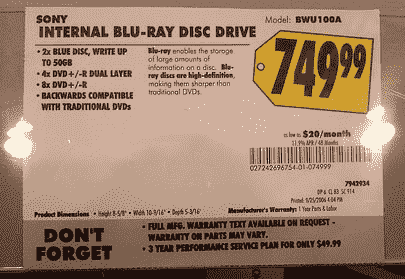

# 为什么 PS3 很划算:749 美元的蓝光光驱

> 原文：<https://web.archive.org/web/http://techcrunch.com/2006/12/27/why-the-ps3-is-a-decent-bargain-749-blu-ray-drives/>

人们抱怨 PS3 怎么要 600 美元等等。如果你正在考虑为你的家庭影院买一个蓝光光驱，PS3 可能是你最便宜的选择。当我今天逛百思买时，我注意到它正在以每张 749 美元的高价出售内置蓝光驱动器。这是一些严重的 moola，即使他们让你刻录到仍然昂贵的蓝光光盘。因此，如果你不关心游戏，只想要一个蓝光驱动器来播放电影，我会说现在就用 Playstation 3 吧。

不过，如果你在圣诞节有花不完的钱，并且想在你的电脑上全力以赴，那就准备好花一千美元买硬盘、空白光盘和几部电影吧。你的电话小子。