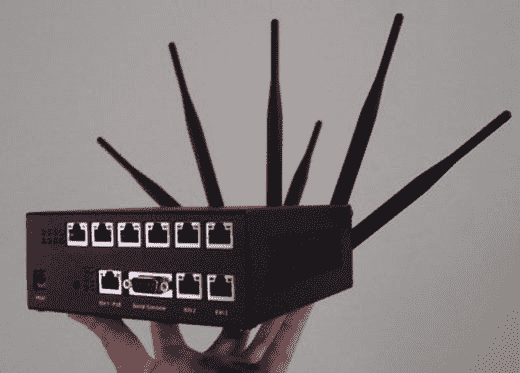

# WiFi Slurpr:终极 WiFi 工具| TechCrunch

> 原文：<https://web.archive.org/web/http://techcrunch.com/2007/05/30/wifi-slurpr-the-ultimate-wifi-tool/>

本着 Web 2.0 的精神，这个设备被命名为 Slurpr。它通过六个无线网络接口吸收该地区所有可用的 WiFi 连接，并将其作为一个快速连接导出。大量的以太网端口可供使用，因此你可以与任何你想要的人分享财富，并将连接提升一个档次。该设备由 Debian 提供支持，包括一个内置的负载平衡器。

但有一个问题。这款设备是由某个天才亲自制作的，每盒收费 1000 欧元，目前只接受预购。做梦真好，对吧？

[WiFi slurper 最多可抓取六个开放网络，并建立一个连接](https://web.archive.org/web/20151118063020/http://www.boingboing.net/2007/05/30/wifi_slurper_grabs_u.html)