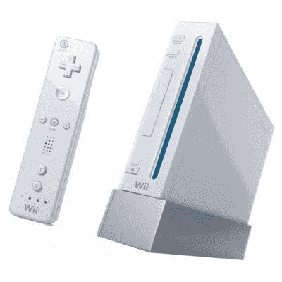

# Wii 吞噬你的照片

> 原文：<https://web.archive.org/web/http://techcrunch.com/2006/11/22/wii-gobbles-up-your-photos/>

# Wii 吞噬你的照片

在任天堂 Wii 论坛上，用户表示他们的任天堂 Wii 系统已经开始通过蓝牙自动与手机同步，并将照片传输到插入 Wii 的 SD 卡上。以下是其中一位用户的说法:

> 当我点击左边的按钮时，我只是进入我的照片频道，只是为了看看打开的菜单(我的 SD 卡上没有照片，或者我是这样认为的)。上面说有 12 张照片。所以，我就像“这里发生了什么”一样看着它们。原来是我哥手机里的图片。

这一说法尚未得到证实，所以我们不知道 Wii 是否可以从手机或任何支持蓝牙的设备上拍照。有人能证明吗？

Wii 吞噬你的照片【任天堂】