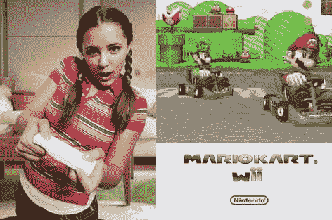

# Wii 马里奥赛车在永远加无限 发布

> 原文：<https://web.archive.org/web/http://techcrunch.com/2007/07/11/wii-mario-kart-comes-out-in-forever-plus-infinity/>

对于我们这些一直不耐烦地等待《马里奥赛车》在 Wii 上发布的人来说，这种等待终于结束了。差不多了。

实际上，不是几乎。差远了。任天堂今天宣布，马里奥赛车将在 2008 年第一季度的某个时候上架。什么？！那是十亿年后的事了。到那时我已经老了，头发花白了。到 2008 年，我可能会有自己的小型车，向过往的司机发射龟壳和其他令人愉快的物体。

如果马里奥赛车上市时你还在市场上，你会很高兴地知道它将具有在线游戏功能，并将配备自己的塑料方向盘，让你可以将 Wiimote 放入其中。价格尚未确定，但如果任天堂坚持“没有超过 50 美元的游戏”的承诺，你可能会以一个相当不错的价格获得游戏和方向盘。

如果历史是一个指标，马里奥赛车应该是任天堂的一个巨大的卖家。另外，在线游戏将会给游戏带来全新的元素。我会在它出来的那天购买它，尽管这个帖子的语气很愤怒。你的“放手”让我心动了！马里奥赛车。我怎么能离开呢？

[《马里奥赛车》登陆带在线游戏的 Wii【News.com 【CNET】](https://web.archive.org/web/20150919045421/http://news.com.com/8301-10784_3-9742519-7.html?part=rss&subj=news&tag=2547-1_3-0-20)