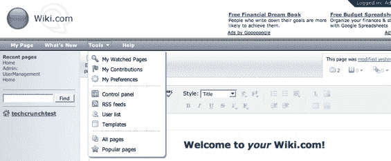

# MindTouch 的 Wiki.com 合作伙伴表示，300 万美元的域名是一笔交易

> 原文：<https://web.archive.org/web/http://www.techcrunch.com:80/2006/08/14/wikicom-lands-a-software-partner-says-for-3-mill-domain-is-a-deal/>

# MindTouch 的 Wiki.com 合作伙伴表示，300 万美元的域名是笔交易

  企业家约翰·戈特同意支付近 300 万美元购买 wiki.com 域名。由于怀疑者说他会通过合同条款退出交易，或者购买是泡沫的一个巨大迹象，高特今天宣布，他已经与总部位于圣地亚哥的维基服务提供商 MindTouch 合作，以域名作为他们战略的核心，进行一场严肃的维基游戏。MindTouch 似乎确实提供了一种高质量的产品，我将在下面详细讨论。

戈特斯表示，他同意向“命名和商标服务”公司[迪纳摩](https://web.archive.org/web/20230220001455/http://www.dynamo.com/)支付近 300 万美元，这是一笔很大的交易。Gotts 坚称，他将完成这笔交易，包括每月支付一系列 1 万美元，从而获得一大笔资金来完成购买。戈特说，对于对维基感兴趣的人来说，Wiki.com 是可以想象到的最自然的网址，他打算以他为这个网址支付的近 300 万美元和每年更新他的域名所有权所花费的 8 美元来结束他的广告预算。他和 AdWare.com 一起工作，重定向到 PCSafe.com，在那里 Gotts 销售广告软件移除软件，他声称该软件非常成功。除了 Gotts 坚持认为不准确的[一份令人发指的报告](https://web.archive.org/web/20230220001455/http://www.spywarewarrior.com/rogue_anti-spyware.htm)之外，几乎没有关于 PCSafe 的信息。

Gotts 在 Digg 的一次讨论中说，当购买被宣布时，他的商业模式是出售 JotSpot 许可证，但现在看来计划是与 MindTouch 合作。“我们还将提供维基百科、维基新闻和维基索引网站的链接，”戈特写道。“我们将看到这一切将如何结束，但这是一个令人兴奋的冒险，我相信这将有益于网络。”对我来说，听起来像是一些令人作呕的领域擅自占地者合理化。

不管怎样，Gotts 说“域名是神奇的”,随着 wikis 变得更加主流，wikis 自然会吸引流量，这将使 300 万美元看起来很划算。在网上 5000 多万个博客中，谷歌只在 blog.com 找到了 487，000 个页面，所以我不确定是否会有很多人指望 wiki.com 来满足他们所有的维基需求。*我认为大多数人在开始向网站填充信息之前都会比较服务提供商。*

 **然而，MediaWiki 的 MindTouch 改编版看起来确实是一个可行的产品。MindTouch 将为 wiki.com 维基提供软件和主机服务。该软件看起来不错，它是 MediaWiki，具有所见即所得的编辑器、更友好的导航、附件和页面层次结构。你可以创建一个账户，并在[http://techcrunchtest.wiki.com](https://web.archive.org/web/20230220001455/http://techcrunchtest.wiki.com/)进行测试。

Gotts 将推动网站的流量，MindTouch 将提供子域名，他们将分享广告收入。严肃的商业模式将很快出现，但它是基于支持维基页面上的电子商务类型的活动。

我们会看到，我们会看到。也许有一天，当我们在 wiki.com 都有维基子域名的时候，这将成为一个美丽的故事。
**