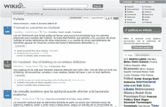

# Wikio 为美国、德国和西班牙推出类似 Digg 的网站 

> 原文：<https://web.archive.org/web/http://www.techcrunch.com:80/2006/12/11/wikio-launches-digg-like-site-for-us-germany-and-spain/>

# Wikio 为美国、德国和西班牙推出类似 Digg 的网站

 [维基奥](https://web.archive.org/web/20220929024839/http://www.wikio.com/)，一家用户贡献的新闻公司，今天在巴黎 [LeWeb3](https://web.archive.org/web/20220929024839/http://www.leweb3.com/) 大会上推出了 Wikio.com、维基奥.德、维基奥. es。这三个新网站分别面向美国、德国和西班牙。

维基奥已经在法国和意大利生活了几个月。他们有 60 万法国用户和 10 万意大利用户。

四月，TechCrunch 法国版作者 Ouriel Ohayon 回顾了 Wikio，发现它是一个非常全面的新闻网站。Ohayon 在查看了该网站后成为了该公司的股东。然而，TechCrunch U.S .与 Wikio 没有财务关系。

 Wikio 是用户添加和编辑添加的新闻和博客的混合体。他们有编辑人员对故事进行排名和投稿，但他们也允许用户添加和排名故事，就像 Digg 一样。用户投票与编辑投票是平衡的，故事也相应地被排序。Wikio 的创始人 Pierre Chappaz 基于他的信念开发了这个网站，他认为欧洲需要一个自己的 Digg。

“Wikio 是欧洲第一个此类服务，”Chappaz 说。“欧洲与美国有很大的不同。在美国，你有各种各样的信息服务，但在欧洲，我们只有谷歌新闻，在某种程度上，还有雅虎新闻。如果你看看 Technorati，他们的指数远远不够全面。因此，Wikio 将在欧洲建立来自博客和传统媒体的新信息，因为我们认为没有任何理由在博客和传统媒体之间竖起一堵墙。”

查帕兹说，Wikio.com 是为“说英语”的人群开发的，尽管英国版的网站是 Wikio 的下一个项目，它将索引英国媒体。

“显然，Wikio.com 最大的市场是美国，如果 Wikio 在美国占据很大的市场份额，我会很高兴，但我们的主要重点仍然是欧洲，”Chappaz 说。

Wikio 成为真正的泛欧洲服务的主要障碍之一是国家之间缺乏互操作性。你可以链接到其他国家的 Wikio 网站，但没有翻译服务。每个国家都有不同的排名算法，基于该国最受欢迎的新闻来源。所以你可以单独搜索每个国家的新闻，但你不能搜索全球活动。

“这很困难，因为存在语言问题。Chappaz 说:“我们未来将在 Wikio 中提供在所有国家搜索 Wikio 的可能性，但你仍然必须理解当地语言。”。