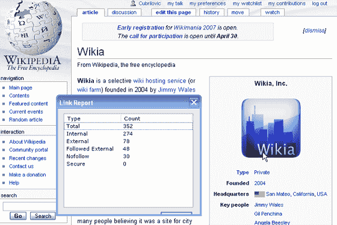

# 维基百科:对维基百科和其他一些维基百科的特殊对待

> 原文：<https://web.archive.org/web/http://www.techcrunch.com:80/2007/04/28/wikipedia-special-treatment-for-wikia-and-other-wikis/>

# 维基百科:对维基和其他一些维基的特殊待遇

最近，当维基百科[宣布](https://web.archive.org/web/20230219135630/http://lists.wikimedia.org/pipermail/wikien-l/2007-January/061137.html)在线百科全书的所有出站链接都将包含 [nofollow 标签](https://web.archive.org/web/20230219135630/http://googleblog.blogspot.com/2005/01/preventing-comment-spam.html)时，引发了很多争议。链接上的 nofollow 标签据说可以防止垃圾链接，因为一些搜索引擎(包括谷歌)不会将包含该标签的链接计入目标页面的权重。这意味着来自维基百科的链接将不再提升页面在搜索结果中的位置，目的是阻止垃圾邮件发送者将链接偷偷放到维基百科上。

2005 年 2 月，维基百科社区[投票赞成](https://web.archive.org/web/20230219135630/http://en.wikipedia.org/wiki/Wikipedia:Nofollow#vote)(61%对 39%的投票)移除 nofollow 标签，但这一结果在今年早些时候被维基百科创始人 Jimbo Wales 否决。似乎虽然 nofollow 标签被添加到了标准的出站链接中，但它并没有应用到[维基间链接](https://web.archive.org/web/20230219135630/http://meta.wikimedia.org/wiki/Interwiki_map)，包括到[维基百科](https://web.archive.org/web/20230219135630/http://www.wikia.com/)的链接，维基百科的盈利性分支。例如，在 Wikia 的 [Wikipedia 页面上，有许多指向不包含 nofollow 标签的 Wikia 页面的链接:](https://web.archive.org/web/20230219135630/http://en.wikipedia.org/wiki/Wikia)

`<a href="/wiki/Wookieepedia" title="Wookieepedia">Wookieepedia</a> <small>(<a href="http://www.wikia.com/wiki/c:Starwars:Main_Page" class="extiw" title="wikiasite:Starwars:Main_Page">home</a>)</small>`

结果是:包含在白名单中的维基被授予不包含“nofollow”标签的出站链接。这些网站直接受益于获得更高的搜索引擎排名，这相当于额外的流量和权威。许多 Wikia 的直接竞争对手，如 Wetpaint，并没有被列入白名单。

没有 nofollow 标签的 Wikia 链接是使用特殊的 Wikipedia 标签 *wikiasite:* 创建的。Wikipedia 的帮助页面中没有提到链接到 Wikia 页面的标签，但是在整个 Wikipedia 和各种主题的讨论页面中有许多对它的引用。这是一种特殊类型的链接，被称为[维基间链接](https://web.archive.org/web/20230219135630/http://meta.wikimedia.org/wiki/Interwiki_map)，这意味着当链接到其他维基(如维基)时，你可以使用特殊的快捷标签。问题是，为什么 nofollow 政策不适用于维基之间的链接？特别是因为与维基有明显的利益冲突，这是你认为维基团队想要避免的。

维基百科包含 nofollow 标签的决定并不受欢迎，许多人[指出](https://web.archive.org/web/20230219135630/http://photomatt.net/2007/01/22/wikipedia-nofollows/)nofollow 在防止垃圾链接方面并不像预期的那样有效。维基百科现在很少有被搜索引擎认可的出站链接，所有这些链接要么是指向维基百科的其他属性，要么是通过维基之间的特殊链接指向其他维基。为什么 nofollow 政策不适用于外部维基的链接，我们还不知道。

为了提供一个公平的竞争环境，维基百科应该包括 nofollow 标签，用于链接到所有其他使用维基媒体平台的维基。

我们已经给维基百科创始人吉米·多纳尔·威尔士和维基百科首席执行官吉尔·潘奇纳发了电子邮件征求意见，但尚未收到回复。

我们收到了吉米·多纳尔·威尔士的回复，他表示他反对 nofollow 政策，只是在谷歌和其他人的建议下才放弃反对 nofollow。我们说吉米基于[发生在这个线程](https://web.archive.org/web/20230219135630/http://lists.wikimedia.org/pipermail/wikien-l/2007-January/061137.html)中的讨论推翻了先前的决定——作为回应，吉米·多纳尔·威尔士声称他没有推翻先前的决定。nofollow 标签是维基百科反垃圾邮件策略的重要组成部分。

